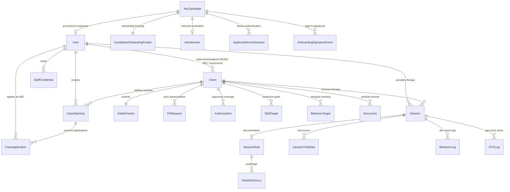

# ABA System Dossier: Simple RAS CRM & HRM Reverse-Engineering Audit

**Document:** Comprehensive Technical & Product Reverse-Engineering Report
**Target File:** `docs/ABA_SYSTEM_DOSSIER.md`
**Date:** 2026-09-05
**Nature of Audit:** READ-ONLY inspection of the actual codebase implementation (`Simple_RAS_CRM`).

---

## 1. Repository Map

### 1.1 Architecture & Monorepo Structure
`Simple_RAS_CRM` is a monorepo organized via npm workspaces (`package.json:5-8`), housing two distinct Next.js App Router applications, two internal packages, and a shared PostgreSQL schema.

```text
Simple_RAS_CRM/
├── apps/
│   ├── crm/                    # Client Management, Intake, Clinical EMR, Billing
│   │   ├── src/
│   │   │   ├── app/            # Next.js App Router (portals, actions, magic-link)
│   │   │   │   ├── (dashboard)/# Route group for internal staff portals
│   │   │   │   │   ├── case/               # Inquiry & Case views
│   │   │   │   │   ├── client/             # Master Client Profile ([id])
│   │   │   │   │   ├── clinical-support/   # Clinical Support triage queue
│   │   │   │   │   ├── notes/              # Legacy alias -> /portal-billing/claims
│   │   │   │   │   ├── ops/                # Executive operations dashboard
│   │   │   │   │   ├── portal-billing/     # VOB, PA trackers, Claims queue
│   │   │   │   │   ├── portal-case/        # Intake & Client pipeline
│   │   │   │   │   ├── portal-case-coord/  # Staffing, Openings, Caseload
│   │   │   │   │   └── portal-clinical/    # BCBA dashboard & queue
│   │   │   │   ├── actions/    # CRM Server Actions ('use server')
│   │   │   │   ├── magic-link/ # External Guardian Intake portal ([id])
│   │   │   │   └── login/      # Staff authentication
│   │   │   ├── components/     # UI dashboards, FlowMap, EMR tabs, Modals
│   │   │   ├── lib/            # Guards, billing math, auth, validation
│   │   │   └── proxy.ts        # Route middleware (Supabase auth & session routing)
│   └── hrm/                    # HR Management, ATS, RBT Portal, Session Studio
│       ├── src/
│       │   ├── app/            # Next.js App Router
│       │   │   ├── (dashboard)/# Route group
│       │   │   │   └── rbt/    # Active RBT workspace (schedule, docs, job board)
│       │   │   ├── actions/    # HRM Server Actions ('use server')
│       │   │   ├── ats/        # ATS Candidate Pipeline (Kanban)
│       │   │   ├── hr-dashboard/# HR agent metrics & staffing
│       │   │   ├── payroll/    # Finance-wide payroll engine & reporting
│       │   │   ├── session-emr/# Live Session Studio data collection
│       │   │   ├── rbt-manager/# RBT management & hours audit
│       │   │   ├── magic-link/ # Candidate applicant portal binding
│       │   │   └── apply/      # Public RBT application form
│       │   ├── components/     # ATS boards, EMR data collection, DevTools
│       │   ├── lib/            # Device sessions, payroll rules, ATS stage engine
│       │   └── proxy.ts        # Route middleware (Applicant & Staff auth)
├── packages/
│   ├── db/                     # Prisma Client wrapper & domain libraries (@repo/db)
│   │   ├── prisma/schema.prisma# Canonical schema definition
│   │   └── src/
│   │       ├── session-note-attestation.ts # Submission fingerprint & hash audit
│   │       └── pilot-cohort-hygiene.ts     # Demo & sandbox data gates
│   └── ui/                     # Shared UI primitives (@repo/ui)
├── docs/                       # Architectural docs, SQL migrations, specs
│   ├── sql/                    # Canonical Supabase SQL patches
│   └── superpowers/specs/      # Feature specifications & roadmaps
└── prisma/
    └── schema.prisma           # Root schema mirror
```

### 1.2 Subsystems and Primary Source Files
* **Authentication & Middleware Guards:**
  * CRM Middleware: `apps/crm/src/proxy.ts`
  * HRM Middleware: `apps/hrm/src/proxy.ts`
  * Staff Role Gates: `apps/crm/src/lib/auth-guard.ts`, `apps/hrm/src/lib/auth-guard.ts`
  * Applicant Device Session Guard: `apps/hrm/src/lib/candidateDeviceSession.ts`
  * Client Magic Link Guard: `apps/crm/src/lib/magicLinkGuard.ts`
* **Intake & Master Pipeline State Machine:**
  * Status Gates & SOP Matrix: `apps/crm/src/lib/clientStatusGates.ts`
  * Intake Actions: `apps/crm/src/app/(dashboard)/portal-case/actions.ts`
  * Visual Pipeline: `apps/crm/src/components/client-profile/FlowMap.tsx`
* **Clinical EMR & Chart Progress:**
  * BCBA Note Co-Signature: `apps/crm/src/app/actions/sessionNoteSignActions.ts`
  * Clinical Review Triage: `apps/crm/src/app/actions/clinicalReviewActions.ts`
  * RBT Data Collection Studio: `apps/hrm/src/components/emr/RbtDataCollectionEngine.tsx`
  * Studio Server Engine: `apps/hrm/src/app/actions/sessionEmrActions.ts`
  * Note Attestation & Tamper Proofing: `packages/db/src/session-note-attestation.ts`
* **Staffing & Cross-App Case Opening Bridge:**
  * CRM Opening Authoring & Assignment: `apps/crm/src/app/actions/caseOpeningActions.ts`
  * HRM Job Board & Matching: `apps/hrm/src/app/actions/caseOpeningActions.ts`
  * Algorithmic Geo/Skill Matcher: `apps/hrm/src/lib/jobBoardMatching.ts`
  * First Session Activation Gate: `apps/crm/src/app/actions/firstSessionActions.ts`
* **Billing, Claims & Payroll:**
  * Plutus Tracker Claims Queue: `apps/crm/src/app/(dashboard)/portal-billing/claims/loader.ts`
  * Claim Scrubber Engine: `apps/crm/src/lib/claimScrubberEngine.ts`
  * Billing Math & MUE Limits: `apps/crm/src/lib/billingMathEngine.ts`
  * Plutus CSV Exporter: `apps/crm/src/lib/billing/plutusExportPacket.ts`
  * Technician Payroll Engine: `apps/hrm/src/app/actions/payrollActions.ts`
  * Finance Agency Payroll: `apps/hrm/src/app/actions/financePayrollActions.ts`

---

## 2. Technology Stack

### 2.1 Core Technologies Verified from Code
* **Languages:** TypeScript 5 (Strict Mode enabled in `tsconfig.json`).
* **Frontend Framework:** Next.js 16.2.10 (App Router, Server Components, Server Actions, Turbopack). React 19.2.4.
* **Styling & CSS:** Tailwind CSS v4 (`@tailwindcss/postcss: ^4`, `@import "tailwindcss";`), CSS Modules, Vanilla CSS theme tokens in `globals.css`.
* **Database & Query Layer:** PostgreSQL accessed via Prisma ORM (`@prisma/client: ^7.8.0`, `@prisma/adapter-pg: ^7.8.0`, `pg: ^8.22.0`). Direct connection pooling via Node Postgres driver.
* **Authentication Provider:** Supabase Auth (`@supabase/ssr: ^0.12.3`, `@supabase/supabase-js: ^2.110.5`).
* **Session & Authorization Mechanisms:**
  * JWT auth cookies (`sb-*-auth-token`) for staff login.
  * Device-bound magic-link session tokens (`ras_device_session_token`, `device_fingerprint`) mapped to `ApplicantDeviceSession` for RBT applicants.
  * Single-use/expiring tokens (`magicLinkToken`, `device_fingerprint`) for client parent intake.
  * Server-side role assertions (`requireStaff()`, `requireRole()`, `requireClientAccess()`).
* **Forms & Validation:** Native Server Actions with hand-rolled schema validation functions (e.g., regex checks, UUID validators, JSON shape checks) and optimistic locking tokens. No Zod/Yup dependencies used in the core flow.
* **Icons & Animation:** `lucide-react: ^1.24.0`, `framer-motion: ^12.42.2`.
* **Notifications & Feedback:** `sonner: ^2.0.7` (toast alerts), internal `Notification` table with polling/optimistic bell counts.
* **PDF Rendering:** `@react-pdf/renderer: ^4.5.1` (used in CRM for treatment plan and packet compilation).
* **Storage & Buckets:** Supabase Storage buckets (`ats-interview-recordings`, `rbt-documents`, `client-documents`).
* **Testing:** Vitest 4.1.10 (118 test files, 1,104 tests), Playwright 1.62.1 (`e2e/playwright.config.ts`).
* **Hosting & Deployment:** Vercel (Next.js serverlessApp Router), Supabase (PostgreSQL, Auth, Storage).

---

## 3. Product Surface

The application is structured into two web applications operating over a single database:
* **CRM (`apps/crm` on port 3000):** Staff client lifecycle, BCBA clinical EMR, billing authorizations, case coordination, parent portal.
* **HRM (`apps/hrm` on port 3001):** Applicant tracking (ATS), RBT technician portal, EVV session data collection studio, technician and executive payroll.

### 3.1 CRM Functional Domains & Route Map

| Route | Primary Actor | Read Scope | Actions / Mutations | Supporting Backend Modules |
| :--- | :--- | :--- | :--- | :--- |
| `/login` | Staff | Auth state | Authenticate email/password via Supabase Auth | `apps/crm/src/app/login/actions.ts` |
| `/magic-link/[id]` | Parent / Guardian | Client intake packet, requested forms, messages | Complete demographic forms, upload insurance/evals, request changes | `apps/crm/src/app/magic-link/[id]/page.tsx`, `apps/crm/src/lib/magicLinkPacketSubmit.ts` |
| `/portal-case` | Intake / PA Coordinator | Caseload list, intake status breakdown | Create new Inquiry, generate magic links, review uploaded docs, reject/approve packet | `apps/crm/src/app/(dashboard)/portal-case/actions.ts` |
| `/client/[id]` | All Staff (scoped) | Master chart: demographics, authorizations, sessions, EMR, notes | Tabbed workspace: documents review, treatment plans, clinical goals, session notes | `apps/crm/src/components/client-profile/ClientProfileTabs.tsx` |
| `/clinical-support` | Clinical Support Staff | Triage queue of clients needing doc cross-checks or assessment scheduling | Approve clinical review, schedule 97151 assessment, assemble report packet | `apps/crm/src/app/(dashboard)/clinical-support/page.tsx`, `apps/crm/src/app/actions/clinicalReviewActions.ts` |
| `/portal-clinical` | BCBA, Clinical Director | Clinical KPIs, supervised cases, unsigned session notes | Assign supervising BCBA, audit goal mastery, review deficiency flags | `apps/crm/src/app/actions/bcbaMetricsActions.ts`, `apps/crm/src/app/actions/sessionNoteSignActions.ts` |
| `/portal-case-coord`| Case Coordinator | Clients in `STAFFING_PENDING`, active openings, RBT applications | Author `CaseOpening`, match RBTs, record parent meet-and-greet, assign RBT | `apps/crm/src/app/actions/caseOpeningActions.ts`, `apps/crm/src/app/actions/firstSessionActions.ts` |
| `/portal-billing` | Billing Agent, Finance | VOB queue, Assessment PA queue, Treatment PA queue | Complete VOB, submit/approve PAs, record payer auth numbers | `apps/crm/src/app/(dashboard)/portal-billing/actions.ts` |
| `/portal-billing/claims` | Billing Agent, Finance | Converted & un-converted session notes, claim scrubber defects | Run claim scrubber, export Plutus CSV, mark note converted (`isConverted`) | `apps/crm/src/app/actions/clientClaimsActions.ts`, `apps/crm/src/lib/billing/plutusExportPacket.ts` |
| `/ops` | Executive (CEO, Directors)| Cross-department operational health, throughput, compliance | View agency metrics, audit vault logs, cohort tracking | `apps/crm/src/app/actions/auditVaultActions.ts`, `apps/crm/src/app/actions/dualRunCohortActions.ts` |

### 3.2 HRM Functional Domains & Route Map

| Route | Primary Actor | Read Scope | Actions / Mutations | Supporting Backend Modules |
| :--- | :--- | :--- | :--- | :--- |
| `/apply` | Public Applicant | Public career form | Submit application, upload resume, store candidate record | `apps/hrm/src/app/actions/publicRbt.ts` |
| `/magic-link/[token]`| Candidate Applicant | Device fingerprint | Bind browser device session to candidate ID | `apps/hrm/src/app/actions/applicantSessionActions.ts` |
| `/ats` | HR Agent, Head HR | Kanban board (Applied -> Screen -> Interview -> Offer -> Hired) | Move stages, assign agent, score interviews, issue NY LS54 wage notice, finalize hire | `apps/hrm/src/app/actions/atsActions.ts`, `apps/hrm/src/app/actions/wageOfferActions.ts`, `apps/hrm/src/lib/hiringDomain.ts` |
| `/hr-dashboard` | HR Staff, Head HR | Active RBT headcount, candidate pipeline counts | Triage recruiting workloads, inspect staff credentials | `apps/hrm/src/app/hr-dashboard/page.tsx` |
| `/rbt` (Tasks) | Candidate / RBT | Onboarding task checklist, 40-hr course progress | Mark task progress, upload 40-hr training cert | `apps/hrm/src/app/actions/fortyHourCourseActions.ts` |
| `/rbt/interview` | Candidate | Interview schedule, video meeting details | Select interview slot, test video/audio equipment | `apps/hrm/src/app/actions/hrInterviewActions.ts` |
| `/rbt/availability`| Candidate | Weekly availability grid, travel preferences | Set commute modes (Car, Transit), boroughs, max travel radius | `apps/hrm/src/app/(dashboard)/rbt/availability/actions.ts` |
| `/rbt/job-board` | Active RBT | Case openings published by CRM Case Coordinators | Review de-identified client cases, inspect geo match score, submit application | `apps/hrm/src/app/actions/caseOpeningActions.ts` |
| `/rbt/schedule` | Active RBT | Scheduled direct therapy sessions | View upcoming sessions, inspect client service address, launch Session Studio | `apps/hrm/src/app/actions/sessionEmrActions.ts` |
| `/session-emr` | Active RBT | Live client programs, skill targets, behavior definitions | Record trial scores (+/-), behavior event frequency/ABC data, capture EVV GPS clock-in/out, submit note | `apps/hrm/src/app/actions/sessionEmrActions.ts` |
| `/rbt/payroll` | Active RBT | Personal timesheets, payable sessions, hold reasons | Inspect hold flags (missing note, missing BCBA signature, missing EVV) | `apps/hrm/src/app/actions/payrollActions.ts` |
| `/payroll` | Finance, CEO | Agency-wide payroll rollup across all technicians | Calculate payable wages using NY LS54 offer rates, audit pay holds, export payroll summaries | `apps/hrm/src/app/actions/financePayrollActions.ts` |
| `/rbt-manager` | Head HR, HR Agent | Active RBT roster, weekly logged hours, compliance | Audit RBT active status, monitor credential expiry | `apps/hrm/src/app/actions/atsActions.ts` |

---

## 4. User Types and Permissions

### 4.1 System Roles (`Role` Enum in `prisma/schema.prisma:20-35`)
1. **Executive Leadership:** `CEO`, `CLINICAL_DIRECTOR`, `OPS_DIRECTOR`
2. **Intake & Coordination:** `INTAKE_PA_COORDINATOR`, `CASE_COORDINATOR`
3. **Clinical Staff:** `BCBA`, `CLINICAL_SUPPORT`, `RBT`
4. **Billing & Finance:** `BILLING`, `FINANCE`, `SESSION_NOTES_COORDINATOR` (legacy DB alias for BILLING)
5. **Human Resources:** `HR`, `HEAD_HR`, `HR_AGENT`
6. **External Actors (Not in `User` Table):**
   * Client Parent/Guardian: Authenticated via single-use / device-locked `IntakePacket.magicLinkToken`.
   * Job Applicant / Candidate: Authenticated via `ApplicantDeviceSession` bound to `AtsCandidate.id`.

### 4.2 Permission Matrix

| Role | Accessible CRM Areas | Accessible HRM Areas | Allowed Mutations | Server-Enforced Boundaries |
| :--- | :--- | :--- | :--- | :--- |
| **CEO / OPS_DIRECTOR** | All portals (`/portal-*`, `/client/*`, `/ops`) | All workspaces (`/ats`, `/payroll`, `/rbt-manager`) | All operations across CRM and HRM | Full administrative access via `LEADERSHIP_ROLES`. |
| **CLINICAL_DIRECTOR**| `/portal-clinical`, `/client/*`, `/clinical-support` | Read-only access to `/ats`, `/session-emr` | Assign BCBAs, review treatment plans, co-sign notes | Gated by `CLINICAL_ROLES`. Cannot execute Plutus claim conversion. |
| **INTAKE_PA_COORDINATOR** | `/portal-case`, `/client/*` (intake tabs) | Blocked by proxy | Create inquiry, issue magic links, approve intake docs, reject docs | Gated by `INTAKE_ROLES`. Blocked from BCBA clinical chart authorship. |
| **CLINICAL_SUPPORT** | `/clinical-support`, `/client/*` | Blocked by proxy | Cross-check intake docs, schedule 97151 assessments, assemble reports | Gated by `CLINICAL_SUPPORT_ROLES`. Cannot convert session notes. |
| **BCBA** | `/portal-clinical`, `/client/*` (assigned cases only) | Blocked by proxy | Write treatment plans, author skill targets, co-sign session notes, flag deficiencies | Scoped via `requireClientAccess(clientId)`: can only read/write assigned cases. |
| **CASE_COORDINATOR**| `/portal-case-coord`, `/client/*` | Blocked by proxy | Author `CaseOpening`, review RBT applications, assign RBT, schedule first session | Gated by `CASE_COORD_ROLES`. Blocked from billing conversion. |
| **BILLING / FINANCE**| `/portal-billing`, `/portal-billing/claims`, `/client/*` | `/payroll` (FINANCE only) | Submit/approve VOB & PAs, scrub claims, mark `isConverted`, export Plutus CSV | Enforced by `BILLING_ROLES` & `SESSION_NOTES_CONVERSION_ROLES`. |
| **HEAD_HR / HR_AGENT**| Blocked by proxy (bounced to HRM) | `/ats`, `/hr-dashboard`, `/rbt-manager` | Advance candidate stages, conduct interviews, issue LS54 offers, finalize hires | Enforced by `HR_ROLES`. Cannot access CRM clinical PHI charts. |
| **RBT (Active)** | Blocked by proxy | `/rbt/*`, `/session-emr` | Clock in/out via EVV, collect trial data, sign notes, apply to case openings | Scoped via `resolveActingRbtContext()`: can only submit notes for assigned sessions. |
| **Parent (External)**| `/magic-link/[id]` | Blocked by proxy | Complete intake forms, upload cards/evals, sign treatment plan | Guarded by `requireParentPacketAccess()` & device fingerprint matching. |
| **Candidate (External)**| Blocked by proxy | `/rbt/interview`, `/rbt/availability`, `/rbt/documents` | Upload 40-hr certificate, submit availability grid, sign LS54 wage notice | Guarded by `ApplicantDeviceSession` cookie and device fingerprint. |

### 4.3 UI-Only vs Server-Enforced Permissions
* **Server-Enforced:** All server actions call `requireStaff(allowedRoles)` or `requireClientAccess(clientId)` as their first statement. Database queries for BCBA/RBT access strictly enforce assignment checks (`client.bcbaId === user.id || client.rbtId === user.id`).
* **UI Leaks / UI-Only Gating:**
  * In `apps/hrm/src/app/hr-dashboard/page.tsx`, the prototype analytics view `HrAgentAnalyticsView` displays hardcoded simulated metrics in non-production environments based purely on `isDevToolsEnabled()`.
  * In `apps/crm/src/components/client-profile/ClientProfileTabs.tsx`, buttons for tabs are selectively hidden based on URL query params (`?mode=bcba` vs `?mode=case-coord`). However, underlying data fetches in Server Actions (`clinicalReviewActions.ts`, `sessionNoteSignActions.ts`) re-validate actual staff identity, preventing authorization bypass.

---

## 5. Database and Domain Model

The database is a single shared PostgreSQL database managed via Prisma (`prisma/schema.prisma` / `packages/db/prisma/schema.prisma`).



### 5.1 Central Entities

#### 1. `User` (`schema.prisma:141-178`)
* **Purpose:** Represents all internal employees (clinical, administrative, operational, billing, and HR staff).
* **Key Fields:** `id` (UUID, Supabase Auth user foreign key), `email`, `firstName`, `lastName`, `role` (`Role` enum), `isActive`.
* **Relationships:** Supervised cases (`Client[]`), sessions conducted (`Session[]`), case openings authored (`CaseOpening[]`), candidate assignments (`AtsCandidate[]`).

#### 2. `Client` (`schema.prisma:180-247`)
* **Purpose:** Central entity for pediatric ABA therapy recipients.
* **Key Fields:** `id` (UUID), `firstName`, `lastName`, `dateOfBirth`, `insurancePayer`, `memberId`, `medicaidId`, `status` (`ClientStatus` enum), `primaryDiagnosisCode`, `treatmentPlan` (JSON), `caseCoordinatorId`, `bcbaId`, `rbtId`, `rbtApproved` (Boolean).
* **Lifecycle:** `INQUIRY` -> `DOCS_SUBMITTED` -> `DOCS_APPROVED_INTAKE` -> `CLINICAL_REVIEW_APPROVED` -> `VOB_COMPLETED` -> `PA_SUBMITTED` -> `PA_APPROVED` -> `ASSESSMENT_SCHEDULED` -> `REPORT_ASSEMBLED` -> `TX_PA_SUBMITTED` -> `TX_PA_APPROVED` -> `STAFFING_PENDING` -> `ACTIVE` -> `DISCHARGED`.

#### 3. `IntakePacket` (`schema.prisma:430-468`)
* **Purpose:** Manages external guardian document submission and onboarding verification.
* **Key Fields:** `clientId` (unique 1:1), `magicLinkToken`, `magicLinkExpiresAt`, `status` (`IntakePacketStatus`), `formData` (JSON), document upload flags (`insuranceCardFrontUploaded`, `diagnosticEvalUploaded`, etc.), `rejectionDetails` (JSON).

#### 4. `Session` & `SessionNote` (`schema.prisma:289-357`)
* **Purpose:** Direct clinical service encounters, EVV compliance, and billable documentation.
* **Key Fields (`Session`):** `clientId`, `rbtId`, `bcbaId`, `status` (`SessionStatus`), `scheduledStart`, `scheduledEnd`, `actualStart`, `actualEnd`, `cptCode`, `placeOfServiceCode` (e.g. `12` for Home).
* **Key Fields (`SessionNote`):** `sessionId` (unique 1:1), `rbtSigned`, `parentSigned`, `bcbaSigned`, `billableUnits`, `structuredContent` (JSON snapshot of SOAP/intervention data), `checklistSnapshot` (JSON), `plutusClaimRef` (external billing tracking code), `isConverted` (Boolean conversion flag), `claimOutcome` (`ClaimOutcome` enum).

#### 5. `CaseOpening` & `CaseApplication` (`schema.prisma:950-1005`)
* **Purpose:** Internal staffing marketplace bridging CRM caseload demands with HRM technician supply.
* **Key Fields (`CaseOpening`):** `clientId`, `createdById`, `caseCode` (e.g. `RAS-NY-102`), `status` (`CaseOpeningStatus`: `OPEN`, `FILLED`, `CLOSED`), `weeklyHours`, `borough`, `zipCode`, `ageBand`, `scheduleJson`.
* **Key Fields (`CaseApplication`):** `openingId`, `rbtUserId`, `status` (`CaseApplicationStatus`: `APPLIED`, `MESSAGING`, `MEET_SCHEDULED`, `PARENT_PENDING`, `APPROVED`, `REJECTED`, `WITHDRAWN`), `meetAt`.

#### 6. `AtsCandidate` & `CandidateOnboardingPacket` (`schema.prisma:717-798`)
* **Purpose:** Recruitment funnel from public web applicant to hired employee.
* **Key Fields (`AtsCandidate`):** `email`, `appliedRole`, `stage` (`APPLIED`, `PHONE_SCREEN`, `INTERVIEW`, `OFFER`, `HIRED`, `REJECTED`), `activationStatus`, `userId` (bound once hired).
* **Key Fields (`CandidateOnboardingPacket`):** `ls54Status` (`NONE`, `DRAFT`, `SENT`, `SIGNED`), `ls54Payload` (JSON New York wage theft prevention notice), `availabilityGrid` (JSON), `tasksCompletedSteps` (JSON), `clearedForHire`.

---

## 6. Current Workflows

### 6.1 Workflow 1: Public Applicant to Hired RBT (ATS Pipeline)
1. **Trigger:** Candidate submits form at `/apply` (`apps/hrm/src/app/actions/publicRbt.ts`).
2. **Actor:** External Candidate -> HR Agent (`HR_AGENT` / `HEAD_HR`).
3. **Preconditions:** Valid email, phone, age confirmation, background check consent.
4. **Steps:**
   1. `submitRbtApplication()` creates `AtsCandidate` (stage: `APPLIED`, activationStatus: `PENDING_HR_REVIEW`) and initial `CandidateOnboardingPacket`.
   2. HR reviews candidate on Kanban at `/ats`. HR calls `inviteCandidate()` which mints `magicLinkToken` and creates `ApplicantDeviceSession` (`apps/hrm/src/app/actions/atsActions.ts:180-240`).
   3. Candidate opens magic link, browser binds `device_fingerprint` cookie via `bindMagicLinkSession()`.
   4. Candidate completes 40-hour RBT course tracker at `/rbt/documents` and books interview at `/rbt/interview`.
   5. HR Agent conducts interview, submits scorecard, and marks recommendation `ADVANCE` (`apps/hrm/src/app/actions/hrInterviewActions.ts`). Candidate stage moves to `OFFER`.
   6. Head HR drafts New York State LS54 Wage Notice via `prepareWageOffer()` (`apps/hrm/src/app/actions/wageOfferActions.ts`).
   7. Candidate e-signs LS54 wage notice. Signature triggers `OnboardingSignatureEvent` with SHA-256 audit hash.
   8. Head HR executes `hireCandidateDomain()` (`apps/hrm/src/lib/hiringDomain.ts`).
5. **Data Mutations:**
   * `User` created with `role: RBT`, `isActive: true`.
   * `AtsCandidate.userId` linked to new `User.id`; stage updated to `HIRED`, `activationStatus: ACTIVE`.
   * `CandidateOnboardingPacket.clearedForHire` set to `true`.
6. **Side Effects:** Internal `Notification` created; welcome audit log stored.
7. **Terminal State:** Candidate is now an employee in `User` and can access `/rbt/schedule` and `/rbt/job-board`.

### 6.2 Workflow 2: Client Intake to Prior Authorization Spine
1. **Trigger:** Intake coordinator creates client inquiry at `/portal-case` (`createInquiry`).
2. **Actor:** Intake Coordinator (`INTAKE_PA_COORDINATOR`) -> Parent/Guardian -> Clinical Support.
3. **Preconditions:** Child demographics and primary guardian contact info.
4. **Steps:**
   1. `createInquiry()` persists `Client` (status: `INQUIRY`).
   2. `generateMagicLink()` creates `IntakePacket` with UUID token; status moves to `MAGIC_LINK_SENT`.
   3. Guardian opens `/magic-link/[id]`, enters medical history, and uploads insurance cards & diagnostic evaluation (`saveIntakeProgress`, `submitIntakePacket`). Status becomes `DOCS_SUBMITTED`.
   4. Intake Coordinator verifies all uploaded cards and evaluations at `/client/[id]?tab=documents`. Calls `sendToClinical()` -> status advances to `DOCS_APPROVED_INTAKE`.
   5. Clinical Support performs medical necessity cross-check at `/clinical-support`. Calls `approveClinicalReview()` -> status advances to `CLINICAL_REVIEW_APPROVED`.
   6. Billing Agent checks eligibility on `/portal-billing`. Calls `completeVobAndCreds()` -> status advances to `VOB_COMPLETED`.
   7. Billing Agent files 97151 Assessment PA in manual tracker (`submitPaRequest()`) -> status becomes `PA_SUBMITTED`.
   8. Payer authorizes 97151 units. Billing calls `approvePaRequest()` -> status becomes `PA_APPROVED`.
5. **Data Mutations:**
   * `Client.status` advances sequentially.
   * `PARequest` created with `type: ASSESSMENT`, `authNumber`, `approvedUnits`.
6. **Terminal State:** Client reaches `PA_APPROVED`, unlocking assessment scheduling.

### 6.3 Workflow 3: Case Opening, Matching, and First Session Activation (Bridge E)
1. **Trigger:** Client reaches `STAFFING_PENDING` after Treatment PA approval (`TX_PA_APPROVED`).
2. **Actor:** Case Coordinator (`CASE_COORDINATOR`) ↔ Active Technician (`RBT`).
3. **Preconditions:** `Client.status === 'STAFFING_PENDING'`, `Client.bcbaId` assigned.
4. **Steps:**
   1. Case Coordinator navigates to `/portal-case-coord` and authors `CaseOpening` via `createCaseOpening()` (`apps/crm/src/app/actions/caseOpeningActions.ts`).
   2. RBT logs into HRM at `/rbt/job-board`. The matching engine (`apps/hrm/src/lib/jobBoardMatching.ts`) evaluates RBT commute radius and availability against the opening.
   3. RBT applies via `applyToCaseOpening()`. `CaseApplication` is created (status: `APPLIED`).
   4. Case Coordinator schedules Meet & Greet (`scheduleMeetAndGreet()`), status becomes `MEET_SCHEDULED`.
   5. Guardian accepts technician. Case Coordinator calls `recordParentDecision(accepted: true)`:
      * `CaseApplication.status` -> `APPROVED`.
      * `Client.rbtId` set to RBT's UUID; `Client.rbtApproved` set to `true`.
      * **CRITICAL INVARIANT:** Client status does **NOT** become `ACTIVE`. It remains `STAFFING_PENDING`.
   6. Case Coordinator schedules the first direct therapy session via `scheduleFirstTherapySession()` (`apps/crm/src/app/actions/firstSessionActions.ts`), creating a durable `Session` (CPT 97153).
   7. After session completion, Case Coordinator triggers `activateAfterFirstSession()`:
      * Validates that a completed non-97151 `Session` with an RBT-signed note exists on record.
      * Updates `Client.status` to `ACTIVE`.
5. **Data Mutations:**
   * `CaseOpening.status` -> `FILLED`.
   * `Client.rbtId` bound, `Client.status` -> `ACTIVE`.
6. **Terminal State:** Client is active in therapy; ongoing billing and supervision commence.

### 6.4 Workflow 4: Live Session EVV, Clinical Data Collection, and Billing Handoff (Bridges F & G)
1. **Trigger:** RBT opens `/session-emr` for an assigned scheduled session.
2. **Actor:** RBT -> BCBA Supervisor -> Billing Coordinator.
3. **Steps:**
   1. RBT clocks in with geolocation telemetry (`clockInCoordinates`), creating an `EVVLog` row.
   2. RBT records skill trials (scores `+`, `-`, prompt level) and behavior reduction ABC events.
   3. RBT clocks out with geolocation (`clockOutCoordinates`).
   4. RBT collects caregiver signature and signs note. Calls `submitHrmSessionEmrNote()` (`apps/hrm/src/app/actions/sessionEmrActions.ts`).
      * Authoritative session duration is computed from timestamps.
      * Billable units are calculated via CMS 8-minute or Medicaid strict-15 rules.
      * Note state is frozen into `checklistSnapshot` and cryptographically hashed into an attestation fingerprint.
   5. BCBA Supervisor reviews note in CRM at `/portal-clinical` or `/portal-billing/claims`.
   6. BCBA calls `signSessionNotesAsBcba()` (`apps/crm/src/app/actions/sessionNoteSignActions.ts`).
      * Checks for open deficiencies. If clean, sets `bcbaSigned: true`, `bcbaSignedAt: new Date()`.
   7. The note enters the Plutus Claims Queue (`apps/crm/src/app/(dashboard)/portal-billing/claims/page.tsx`).
   8. Claim Scrubber evaluates auth limits, MUE caps, POS codes, and diagnosis codes (`apps/crm/src/lib/claimScrubberEngine.ts`).
   9. Billing Agent records claim filing in external Plutus clearinghouse, sets `plutusClaimRef`, and flips `isConverted: true`.
   10. In HRM, Finance runs `/payroll` (`apps/hrm/src/app/actions/financePayrollActions.ts`), which ingests `isConverted` / `bcbaSigned` notes and multiplies billable units by the RBT's LS54 contractual wage.
5. **Data Mutations:**
   * `Session.status` -> `COMPLETED`.
   * `SessionNote` signed by RBT, Parent, BCBA; `isConverted: true`.
   * `EVVLog` clock-out captured.
6. **Terminal State:** The session is fully documented, co-signed, verified clean, exported for billing, and factored into payroll.

---

## 7. Status and State Machines

### 7.1 Master Client Pipeline (`ClientStatus`)
Defined in `prisma/schema.prisma:37-53` and governed by `apps/crm/src/lib/clientStatusGates.ts:9-25`:

```text
INQUIRY
  ↓ (generateMagicLink)
MAGIC_LINK_SENT
  ↓ (submitIntakePacket)
DOCS_SUBMITTED
  ↓ (sendToClinical)
DOCS_APPROVED_INTAKE
  ↓ (approveClinicalReview)
CLINICAL_REVIEW_APPROVED
  ↓ (completeVobAndCreds)
VOB_COMPLETED
  ↓ (submitPaRequest)
PA_SUBMITTED
  ↓ (approvePaRequest)
PA_APPROVED
  ↓ (scheduleAssessmentEvent)
ASSESSMENT_SCHEDULED
  ↓ (assembleReportPacket)
REPORT_ASSEMBLED
  ↓ (submitTreatmentPaRequest)
TX_PA_SUBMITTED
  ↓ (approveTreatmentPaRequest)
TX_PA_APPROVED
  ↓ (handoffToStaffing)
STAFFING_PENDING
  ↓ (activateAfterFirstSession)
ACTIVE
  ↓ (dischargeClient)
DISCHARGED
```

* **Transition Enforcement:** `assertPredecessor(current, allowedFrom, targetStatus)` in `apps/crm/src/lib/clientStatusGates.ts:193-213` prevents skipping prerequisite steps.
* **Side Effects:** Status advances trigger unread notifications to relevant staff (`apps/crm/src/lib/intakeWorkflowNotifications.ts`).
* **Hard Invariant:** `STAFFING_PENDING -> ACTIVE` can **never** occur via RBT assignment alone. It strictly requires a persisted non-97151 `Session` with an RBT-signed `SessionNote` on record (`apps/crm/src/app/actions/firstSessionActions.ts:250-320`).

### 7.2 ATS Candidate Lifecycle (`AtsCandidate.stage` & `activationStatus`)
Defined in `apps/hrm/src/lib/atsStage.ts:20-60`:

```text
APPLIED (activationStatus: PENDING_HR_REVIEW)
  ↓ (inviteCandidate - mints magic link)
PHONE_SCREEN / INVITATION_SENT
  ↓ (completeInterview - recommendation: ADVANCE)
INTERVIEW
  ↓ (prepareWageOffer - LS54 sent)
OFFER
  ↓ (hireCandidateDomain - all blockers cleared)
HIRED (activationStatus: ACTIVE)
```

* **Hire Readiness Gate:** `checkHireReadiness()` in `apps/hrm/src/lib/hiringDomain.ts:130-240` enforces 10 strict blocking checks before hire:
  1. `LS54_NOT_SIGNED`: LS54 wage notice must be signed.
  2. `LS54_SIGNATURE_STALE`: Signed notice hash must match current version.
  3. `ONBOARDING_TASKS_INCOMPLETE`: All required checklist steps completed.
  4. `AVAILABILITY_INCOMPLETE`: Weekly availability grid must be populated.
  5. `INTERVIEW_NOT_APPROVED`: Interview recommendation must be `ADVANCE`.
  6. `BACKGROUND_CLEARANCE_REQUIRED`: Background check must be verified.

---

## 8. HRM Domain Implementation Audit

| Feature Area | Status | Implementation Details |
| :--- | :---: | :--- |
| **Recruitment / ATS** | **IMPLEMENTED** | Kanban board at `/ats`, applicant stages, interview scheduling, scorecard evaluation, interview recording attachments. (`apps/hrm/src/app/actions/atsActions.ts`) |
| **Applicant Onboarding**| **IMPLEMENTED** | 40-hr course step tracker, certificate PDF uploads, NY LS54 Wage Notice drafting, SHA-256 e-signing. (`apps/hrm/src/lib/hiringDomain.ts`, `apps/hrm/src/app/actions/wageOfferActions.ts`) |
| **Technician Scheduling**| **IMPLEMENTED** | Weekly calendar view at `/rbt/schedule`, integration with CRM-scheduled sessions, session launch gates. (`apps/hrm/src/components/rbt/RbtScheduleView.tsx`) |
| **Job Board (Staffing)**| **IMPLEMENTED** | De-identified case board at `/rbt/job-board`, Haversine transit distance calculations, borough/schedule matching. (`apps/hrm/src/lib/jobBoardMatching.ts`) |
| **EVV & Data Collection**| **IMPLEMENTED** | Live trial data collection (+/-/prompts), ABC event logging, GPS clock-in/out telemetry, attestation fingerprinting. (`apps/hrm/src/app/actions/sessionEmrActions.ts`) |
| **Technician Payroll** | **IMPLEMENTED** | Personal timesheet at `/rbt/payroll`, hold detection (unco-signed notes, EVV discrepancies, open deficiencies). (`apps/hrm/src/app/actions/payrollActions.ts`) |
| **Agency Payroll** | **IMPLEMENTED** | Company-wide payroll workspace at `/payroll`, LS54 hourly rate lookup, multi-week date range rollup. (`apps/hrm/src/app/actions/financePayrollActions.ts`) |
| **Staff Credentialing** | **IMPLEMENTED** | Watchdog service checking BACB licenses, CPR certifications, NPI, and Medicaid IDs with 30/60-day warning alerts. (`apps/hrm/src/lib/staffCredentials.server.ts`) |
| **Leave & Paid Time Off**| **NOT FOUND** | No models, tables, or routes exist for PTO, sick days, or vacation requests. |
| **Performance Reviews** | **PARTIAL** | Basic interview scorecards exist; post-hire clinical performance reviews are not implemented. |

---

## 9. CRM Domain Implementation Audit

| Feature Area | Status | Implementation Details |
| :--- | :---: | :--- |
| **Inquiry & Intake** | **IMPLEMENTED** | Inquiry creation, tokenized magic-link generation, continuous intake form completion, insurance upload handling. (`apps/crm/src/app/(dashboard)/portal-case/actions.ts`) |
| **Document Vault** | **IMPLEMENTED** | Client medical record archive (diagnostic evals, IEPs, insurance cards, prior ABA records) with verification status. (`apps/crm/src/app/actions/emrDocumentVaultActions.ts`) |
| **Clinical Review** | **IMPLEMENTED** | Clinical Support triage queue, medical necessity cross-check, approval audit log. (`apps/crm/src/app/actions/clinicalReviewActions.ts`) |
| **Authorizations & VOB** | **IMPLEMENTED** | Verification of benefits tracking, Assessment PA & Treatment PA manual tracker with payer auth numbers and units. (`apps/crm/src/app/(dashboard)/portal-billing/actions.ts`) |
| **Clinical EMR (BCBA)** | **IMPLEMENTED** | Skill targets, prompt hierarchies, baseline data, behavior definitions, treatment plan JSON authoring, PDF generation. (`apps/crm/src/app/actions/clinicalGoalsActions.ts`) |
| **Case Coordination** | **IMPLEMENTED** | Caseload tracking, authoring `CaseOpening` listings, RBT application triage, Meet & Greet scheduling, parent decision capture. (`apps/crm/src/app/actions/caseOpeningActions.ts`) |
| **First Session Bridge** | **IMPLEMENTED** | Scheduling of initial 97153 therapy encounter, gating `ACTIVE` status until first completed session. (`apps/crm/src/app/actions/firstSessionActions.ts`) |
| **Session Notes Pipeline**| **IMPLEMENTED** | BCBA co-signature queue, deficiency management, Plutus manual claim conversion queue. (`apps/crm/src/app/actions/sessionNoteSignActions.ts`, `/portal-billing/claims`) |
| **Billing & Scrubbing** | **IMPLEMENTED** | Pre-submission claim scrubber, MUE daily limit evaluation, CMS 8-minute rounding calculations, Plutus CSV export. (`apps/crm/src/lib/claimScrubberEngine.ts`, `apps/crm/src/lib/billingMathEngine.ts`) |
| **Re-Authorization** | **IMPLEMENTED** | Re-Auth Packet compiler aggregating trial accuracy, prompt-fading curves, and behavior reduction metrics. (`apps/crm/src/app/actions/reAuthPacketActions.ts`) |
| **Native EDI 837/835** | **NOT FOUND** | Intentionally not implemented. System relies on external claims processing via Plutus Health CSV handoff. |

---

## 10. HRM ↔ CRM Integration Analysis

The application enforces a **data-and-notification integration pattern** across a single shared PostgreSQL database rather than embedding micro-frontends or iframes.

```text
CRM Domain (apps/crm)                       HRM Domain (apps/hrm)
┌────────────────────────┐                 ┌────────────────────────┐
│  Case Coordinator      │                 │  Active RBT Staff      │
│  posts CaseOpening     │──── Postgres ──▶│  views /rbt/job-board  │
│  (de-identified specs) │                 │  submits Application   │
└────────────────────────┘                 └────────────────────────┘
            ▲                                           │
            │                                           ▼
┌────────────────────────┐                 ┌────────────────────────┐
│  Case Coordinator      │◀─── Postgres ───│  RBT executes session  │
│  approves Application; │                 │  in Session Studio;    │
│  schedules Session     │                 │  submits SessionNote   │
└────────────────────────┘                 └────────────────────────┘
            │                                           │
            ▼                                           ▼
┌────────────────────────┐                 ┌────────────────────────┐
│  BCBA Supervisor       │                 │  Finance Agent reviews │
│  co-signs SessionNote; │──── Postgres ──▶│  hourly earnings at    │
│  Billing exports claim │                 │  /payroll via LS54 rate│
└────────────────────────┘                 └────────────────────────┘
```

1. **Shared Database & Schema:** Both apps import `@repo/db` and connect to the identical PostgreSQL instance.
2. **Case Opening Marketplace:** CRM authors `CaseOpening` rows (`apps/crm/src/app/actions/caseOpeningActions.ts`). HRM reads and scores them against RBT preferences (`apps/hrm/src/app/actions/caseOpeningActions.ts`). RBT applies; CRM reviews applicants and links `Client.rbtId`.
3. **Session EMR & Attestation:** CRM schedules `Session` rows. HRM runs the live encounter via `/session-emr` and writes `SessionNote`, `SessionTrialData`, `BehaviorLog`, and `EVVLog`. CRM BCBAs co-sign the note, unlocking billing.
4. **Payroll Bridge:** HRM's finance payroll engine (`apps/hrm/src/app/actions/financePayrollActions.ts`) queries `Session` and `SessionNote` rows co-signed in CRM, resolves the technician's agreed wage from `CandidateOnboardingPacket.ls54Payload`, and computes pay.
5. **Notification Fan-out:** Both apps read and write to the shared `Notification` table via a unified deduplication dispatcher (`apps/crm/src/app/actions/notifications.ts` / `apps/hrm/src/app/actions/notifications.ts`).

---

## 11. Backend & API Architecture

The backend architecture is built primarily on **Next.js Server Actions** (`'use server'`) rather than traditional REST API controllers.

### 11.1 Architectural Pattern
Every server action adheres to the repository's strict server action pattern:
1. **Entry Gate:** Calls `requireStaff(roles)` or `requireClientAccess(clientId)`.
2. **Transaction & Concurrency Safety:** High-stakes financial and clinical mutations are wrapped in `prisma.$transaction` with optimistic concurrency checks (e.g., checking `expectedNoteUpdatedAt` or `expectedClientStatus`).
3. **Audit Vaulting:** Audited actions write immutable records into `AuditLogVault`.
4. **Revalidation:** Affected Next.js App Router paths are cleared using `revalidatePath()`.
5. **Standardized Response:** Returns structured tuples: `{ success: true, data?: T }` or `{ success: false, error: string, code?: string }`.

### 11.2 Architectural Health Flags
* **Strong Concurrency Controls:** `firstSessionActions.ts`, `sessionNoteSignActions.ts`, and `wageOfferActions.ts` feature serializable transaction retries (`P2034` conflict handling) to prevent race conditions during co-signing or hiring.
* **Duplication Across Apps:** Certain utility functions (e.g., notification dispatchers, staff credential check functions) are duplicated between `apps/crm/src/lib/` and `apps/hrm/src/lib/` rather than being fully extracted into a shared workspace package.
* **Boundary Discipline:** CRM strictly refrains from mutating HR candidate tables; HRM strictly refrains from modifying client treatment plans or diagnostic codes.

---

## 12. Architecture Assessment

| Pillar | Rating | Assessment |
| :--- | :---: | :--- |
| **Data Model Integrity** | **STRONG** | Relational integrity in PostgreSQL is high. Cascading deletes are placed carefully. Status progression across the 15-stage client pipeline is strictly codified. |
| **Authorization & Scoping** | **STRONG** | Server actions fail closed. BCBA access is scoped to assigned clients. Proxy middleware protects routes against unauthenticated requests. |
| **Clinical Attestation Safety** | **STRONG** | Session notes enforce SHA-256 fingerprinting and optimistic concurrency. Billing conversions are blocked until BCBAs resolve open deficiencies. |
| **Cross-App Decoupling** | **ACCEPTABLE** | Clean separation of concerns between CRM and HRM. However, code duplication in utilities creates maintenance overhead. |
| **Mock & Prototype Isolation** | **ACCEPTABLE** | Fake prototypes (e.g., `HrAgentAnalyticsView`, RBT simulation training) are gated behind `isDevToolsEnabled()` or labeled clearly as training attempts. |
| **Monorepo Package Structure** | **FRAGILE** | `@repo/db` exports Prisma, but root `prisma/schema.prisma` must be manually kept in sync with `packages/db/prisma/schema.prisma`. |

---

## 13. Identified Workflow Problems

### 13.1 Confirmed Issues
1. **Manual CSV Billing Queue (No Automated Payer Feedback):**
   * *Location:* `apps/crm/src/app/(dashboard)/portal-billing/claims/`
   * *Problem:* Conversion tracking relies entirely on human staff manually entering `plutusClaimRef` strings after copying CSV rows into an external system. There is no automated webhook or 835 ERA parser to automatically record claim denials or remittances.
2. **Schema Parity Requirement:**
   * *Location:* `prisma/schema.prisma` vs `packages/db/prisma/schema.prisma`
   * *Problem:* Changes to the database model require identical updates in two separate files. Any discrepancy will fail the build or desynchronize generated types.
3. **DevTools Impersonation Context in Local Dev:**
   * *Location:* `apps/crm/src/proxy.ts`, `apps/hrm/src/proxy.ts`
   * *Problem:* Impersonating staff accounts without active Supabase sessions previously caused redirection loops to `/login`. (Recently addressed via non-production bypass cookies).

### 13.2 Suspected Bottlenecks / Workflow Debt
1. **Parent Intake Fallback:**
   * If a parent loses or expires their magic link, they must contact the clinic by phone to have a coordinator regenerate it. A self-service SMS/email verification re-send flow does not currently exist.
2. **Double-Booking Heuristics:**
   * `schedulingConcurrencyEngine.ts` calculates overlaps, but in-home transit travel buffers (e.g., 30-minute buffer between appointments) only emit warnings rather than hard-blocking the calendar.

---

## 14. Testing & Reliability

* **Automated Test Suite:** 118 test files, 1,104 tests running via Vitest (`npm test`), all passing (100% pass rate).
* **Test Coverage Areas:**
  * **Authorization & Security:** Tests verify role-based restrictions on server actions (`sessionEmrActions.security.test.ts`, `sessionNoteSignActions.test.ts`, `wageOfferActions.security.test.ts`).
  * **Concurrency & Race Conditions:** Tests verify optimistic locking and retry handling during note co-signature and candidate hiring.
  * **Domain Logic:** Billing math (CMS 8-minute vs strict 15), MUE daily limits, Haversine travel distance matching, and candidate LS54 state transitions are thoroughly unit-tested.
* **Gaps in Testing:**
  * End-to-end browser automation tests (`playwright test`) are configured in `e2e/playwright.config.ts` but are not run in standard CI due to the lack of live Supabase test credentials in automated environments.

---

## 15. Final Software Dossier (System Context for Engineers & AI)

### 15.1 What ABA Is
Applied Behavior Analysis (ABA) is an evidence-based therapy for children diagnosed with Autism Spectrum Disorder (ASD). In the United States, ABA delivery is heavily regulated:
* **Physician Referral & Diagnostic Evaluation:** Diagnoses of ASD (e.g., ICD-10 F84.0) must be established by a physician or psychologist.
* **Prior Authorization (PA):** Insurance payers require two separate authorizations:
  1. **Assessment PA (CPT 97151):** Authorizes a licensed Board Certified Behavior Analyst (BCBA) to conduct initial assessments and write a Treatment Plan.
  2. **Treatment PA (CPT 97153, 97155, 97156):** Authorizes recurring direct therapy (97153) delivered by Registered Behavior Technicians (RBTs), protocol modifications by BCBAs (97155), and caregiver training (97156).
* **Electronic Visit Verification (EVV):** Under the 21st Century Cures Act, Medicaid and commercial payers mandate GPS-verified clock-in/out timestamps for in-home services.
* **Billing Increments:** Billed in 15-minute units subject to strict payer rounding rules (CMS 8-minute midpoint rule vs Medicaid strict-15 rule) and daily Maximum Unlikely Edits (MUE) limits.

### 15.2 Who Uses the System
* **Parents / Guardians:** Submit insurance, medical records, and consents via secure magic links; review and approve treatment plans.
* **Intake / PA Coordinators:** Gather parent documents, verify benefits (VOB), and file assessment/treatment authorizations.
* **Clinical Support Staff:** Cross-check clinical document integrity, schedule 97151 assessments, and assemble formal clinical packets.
* **Board Certified Behavior Analysts (BCBAs):** Author treatment plans, define skill/behavior targets, supervise technicians, and co-sign session notes.
* **Registered Behavior Technicians (RBTs):** Provide direct in-home therapy, clock in/out via EVV, record discrete trial data, and author daily session notes.
* **Case Coordinators:** Manage client caseloads, post case openings, match technicians, and schedule initial sessions.
* **HR Agents & Head of HR:** Recruit technicians, evaluate interviews, issue contractual LS54 wage notices, and onboard staff.
* **Billing & Finance Specialists:** Verify claim readiness, scrub notes against payer rules, export claims to Plutus Health, and run payroll.

### 15.3 Core Workflows
1. **Intake to Auth Spine:** `INQUIRY` -> Guardian Magic Link -> Doc Collection -> Clinical Cross-Check -> VOB -> Assessment PA -> 97151 Assessment -> Treatment Plan -> Treatment PA -> `STAFFING_PENDING`.
2. **ATS Hiring Funnel:** Public Application -> Screening -> Video Interview -> LS54 Wage Offer Signing -> Background Clearance -> Promotion to Employee (`User`).
3. **Staffing Marketplace:** Case Coordinator posts `CaseOpening` -> RBT applies on HRM Job Board -> Parent Meet & Greet -> RBT assigned -> First Session Scheduled -> Completed Session -> `Client.status: ACTIVE`.
4. **Therapy to Billing/Payroll:** RBT clocks in via EVV -> Collects trial data -> Signs note -> BCBA co-signs note -> Claim Scrubber evaluates defects -> Claim converted for Plutus Health -> Units ingested into Finance Payroll.

### 15.4 Critical Files to Read First
1. **System Spine & Status Gates:** [`apps/crm/src/lib/clientStatusGates.ts`](file:///c:/Users/azmrk/Documents/GitHub/Simple_RAS_CRM/apps/crm/src/lib/clientStatusGates.ts)
2. **Database Schema:** [`prisma/schema.prisma`](file:///c:/Users/azmrk/Documents/GitHub/Simple_RAS_CRM/prisma/schema.prisma)
3. **Staff Permissions & Guards:** [`apps/crm/src/lib/auth-guard.ts`](file:///c:/Users/azmrk/Documents/GitHub/Simple_RAS_CRM/apps/crm/src/lib/auth-guard.ts), [`apps/hrm/src/lib/auth-guard.ts`](file:///c:/Users/azmrk/Documents/GitHub/Simple_RAS_CRM/apps/hrm/src/lib/auth-guard.ts)
4. **Clinical Session Studio Engine:** [`apps/hrm/src/app/actions/sessionEmrActions.ts`](file:///c:/Users/azmrk/Documents/GitHub/Simple_RAS_CRM/apps/hrm/src/app/actions/sessionEmrActions.ts)
5. **BCBA Note Signature & Claim Guard:** [`apps/crm/src/app/actions/sessionNoteSignActions.ts`](file:///c:/Users/azmrk/Documents/GitHub/Simple_RAS_CRM/apps/crm/src/app/actions/sessionNoteSignActions.ts)
6. **Hiring Domain & LS54 Engine:** [`apps/hrm/src/lib/hiringDomain.ts`](file:///c:/Users/azmrk/Documents/GitHub/Simple_RAS_CRM/apps/hrm/src/lib/hiringDomain.ts)
7. **First Session & Activation Guard:** [`apps/crm/src/app/actions/firstSessionActions.ts`](file:///c:/Users/azmrk/Documents/GitHub/Simple_RAS_CRM/apps/crm/src/app/actions/firstSessionActions.ts)
8. **Claim Scrubber & Billing Math:** [`apps/crm/src/lib/claimScrubberEngine.ts`](file:///c:/Users/azmrk/Documents/GitHub/Simple_RAS_CRM/apps/crm/src/lib/claimScrubberEngine.ts), [`apps/crm/src/lib/billingMathEngine.ts`](file:///c:/Users/azmrk/Documents/GitHub/Simple_RAS_CRM/apps/crm/src/lib/billingMathEngine.ts)
