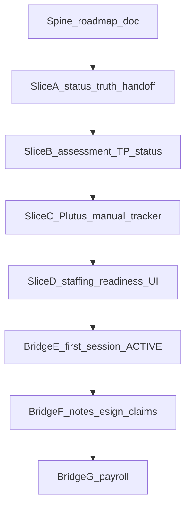

# ABA CRM / HRM Spine Roadmap

**Date:** 2026-08-11  
**Status:** Approved (Build)  
**Supersedes:** Phase 2/3 blurbs in [`2026-08-10-hrm-ats-crm-bridge-design.md`](./2026-08-10-hrm-ats-crm-bridge-design.md) for sequencing after ATS Phase 1  
**Apps:** `apps/crm` (client product), `apps/hrm` (HR product)

---

## Opinion (blunt)

You are **not** “pretty much finished” on the full CRM master pipeline — you are **finished on the intake→manual PA spine**, and **early** on honest Case Coord activation + clinical ops after auth.

| Area | Score | Notes |
|---|---|---|
| Intake → Clinical → VOB/Assessment PA → TP JSON + parent typed sign → Treatment PA (manual tracker) | ~7–8/10 | Feels done for a Plutus-as-external manual model |
| Assessment scheduling as a real event, deterministic Case Coord handoff, first session → ACTIVE, billable notes e-sign, claims tracker, payroll bridge | ~2–4/10 | UI often fakes completion |
| **Overall CRM master pipeline today** | **~5.0/10** | |
| Job board | Bridge v1 done | Freeze; do not mix into HRM applicant work |
| **HRM applicant cycle** | **COMPLETE** | Stop touching unless regressions |

HRM applicant is clear; CRM must stand alone until Case Coord can own an authorized client; then deepen connections (sessions, notes, Plutus tracker, payroll).

---

## 1. Product boundaries

| Lane | Owns | Does not own |
|---|---|---|
| **CRM** | Clients, intake, clinical/BCBA, billing (manual Plutus tracker), Case Coord, case openings / job posts | ATS applicant lifecycle, RBT careers product, payroll product |
| **HRM** | ATS, applicants, RBT portal, hire → User, job applications against CRM openings | Client clinical status, Treatment PA, Case Coord readiness |
| **Shared** | One Postgres DB (`Prisma`), `Notification` rows, `User` with role flags | Embedded HR suite inside CRM / embedded clinical suite inside HRM |

Cross-app collaboration is **data + notifications**, not embedded UI.

```text
CRM writes CaseOpening + clinical / PA status
HRM writes AtsCandidate hire + RbtJobApplication
Both read Notification for signed-in user
```

---

## 2. HRM lane

| Sub-lane | Status | Notes |
|---|---|---|
| Applicant cycle (apply → screen → interview → offer → hire) | **COMPLETE** | Durable ATS; do not reopen unless regressions |
| RBT portal (tasks, docs, schedule shell, onboarding) | Independent | Continues on its own track |
| Job board (apply to CRM `CaseOpening`) | **BRIDGE_V1** | Working; polish notifications later; freeze as bridge v1 |
| Session notes / payroll | **BRIDGES_E_F_G** | First session → ACTIVE; BCBA e-sign → Plutus tracker; durable payroll from signed notes |

---

## 3. CRM master pipeline — stage ratings

Full enum path (authoritative; see also `.agents/skills/intake-workflow-map/SKILL.md`):

```
INQUIRY → MAGIC_LINK_SENT → DOCS_SUBMITTED → DOCS_APPROVED_INTAKE
→ CLINICAL_REVIEW_APPROVED → VOB_COMPLETED → PA_SUBMITTED → PA_APPROVED
→ ASSESSMENT_SCHEDULED → REPORT_ASSEMBLED → TX_PA_SUBMITTED → TX_PA_APPROVED
→ STAFFING_PENDING → ACTIVE → DISCHARGED
```

| Stage | Score | Status | Owner | Gaps / “done” means |
|---|---|---|---|---|
| Inquiry / create | 8 | DONE | Intake | Keep; tighten role guards later |
| Magic link + parent intake | 7 | PARTIAL | Intake | Email send + durable storage later; flow works with copy link |
| Intake review → clinical | 8 | DONE | Intake | Optional: hard-gate all docs approved |
| Clinical support double-check | 7 | PARTIAL | Clinical Support | Deduplicate clinical action paths |
| VOB / Assessment PA (manual) | 7 | PARTIAL | Billing | Keep as Plutus manual tracker; OK by design |
| BCBA assessment schedule/complete | 3.5 | PARTIAL | BCBA / Clin Supp | Persist real assessment datetime/event (Slice B) |
| TP build + BCBA e-sign | 7 | PARTIAL | BCBA | Advance `ClientStatus` on submit; stronger audit later; typed-name e-sign OK for now |
| Parent TP sign | 6.5 | PARTIAL | Parent / Clin Supp | Status progression on sign (Slice B) |
| Treatment PA (manual) | 7 | PARTIAL | Billing | Same tracker pattern; OK by design (Slice C cleanup) |
| Case Coord handoff readiness | 4.5 | PARTIAL | Case Coord | Explicit `TX_PA_APPROVED` → `STAFFING_PENDING` + checklist (Slices A, D) |
| CD BCBA assign | 6.5 | PARTIAL | Clinical Director | Gate by stage; stop `assignClinicalTeam` skipping PA (Slices A, D) |
| Job board staffing | 6.5 | BRIDGE | Case Coord ↔ HRM | Working; polish notifications later |
| First session → ACTIVE | 7 | **DONE** (Bridge E) | Case Coord | Durable Session schedule + activate-after-first-session; fake 3-way match removed |
| Ongoing weekly management | 4 | PARTIAL | Case Coord | After ACTIVE is honest |
| Notes → BCBA sign → claims tracker | 7 | **DONE** (Bridge F) | BCBA / Billing | Persist `bcbaSigned`; manual Plutus queue gated on sign |
| Notes → HRM payroll | 7 | **DONE** (Bridge G) | Finance / HRM | Payroll from signed SessionNote rows |

### FlowMap mismatches (known)

In [`FlowMap.tsx`](../../../apps/crm/src/components/client-profile/FlowMap.tsx):

- Collapsed nodes (e.g. `PA_APPROVED` displayed as Assessment; `TX_PA_APPROVED` as Staffing)
- SOP historically said “HR assigns RBT” — Case Coord + job board is the real path (fixed in Slice A)
- Visual false clinical-review states possible when packet/status diverge
- `ACTIVE` was reachable without a `Session` row via staffing accept / assign hacks (guarded in Slice A)

---

## 4. Connection map (named handoffs only)

| Bridge | From → To | Mechanism | Status |
|---|---|---|---|
| Job board | Case Coord posts opening → RBT applies in HRM | `CaseOpening` + `RbtJobApplication` + notifications | BRIDGE_V1 |
| BCBA assign | CD / clinical assigns supervising BCBA | `Client.bcbaId` + stage gates | PARTIAL |
| First session | Staffed client → ACTIVE | Durable `Session` then status flip | **DONE** (Bridge E) |
| Notes → Plutus tracker | Signed note → billing queue | Manual tracker fields; no EDI | **DONE** (Bridge F) |
| Notes → payroll | Signed/approved units → HRM pay | Replace payroll `localStorage` holds | **DONE** (Bridge G) |

---

## 5. Build sequence

### CRM finish-line (Slices A–D)

| Slice | Focus | Outcome |
|---|---|---|
| **A** | Status truth + Case Coord handoff gate | `TX_PA_APPROVED` → `STAFFING_PENDING` explicit; no fake `ACTIVE`; FlowMap SOP fixed |
| **B** | Assessment + TP status wiring | Persist assessment schedule; advance status on TP submit / parent sign / report assemble |
| **C** | Billing as intentional Plutus manual tracker | One clear ownership surface; Assessment/Treatment PA tracker only; no EDI |
| **D** | Staffing readiness UI | Checklist → post/manage opening → review apps → parent accept; CD BCBA assign gated |

### Later bridges (E–G) — **implemented 2026-08-11**

| Bridge | Focus | Status |
|---|---|---|
| **E** | Durable first session → `ACTIVE` | DONE — Case Coord schedule + activate UI |
| **F** | Billable session notes + persist BCBA `bcbaSigned` + manual claims tracker | DONE — workstation/notes gated on durable sign; clinical field SoT: [`2026-08-11-aba-session-note-data-collection-spec.md`](./2026-08-11-aba-session-note-data-collection-spec.md) |
| **G** | Notes feed HRM payroll | DONE — payroll from Session+SessionNote; local holds secondary; gates align to same SoT checklist |



### Success criteria (end of Slice D)

1. Client can be walked Inquiry → `STAFFING_PENDING` with honest status transitions (no skipped PA via assign hacks).
2. Case Coord sees a readiness checklist before posting to job board.
3. FlowMap / skill map match the real enum and SOP.
4. Billing remains a manual Plutus tracker by design (documented, not accidental).
5. `ACTIVE` is **not** granted by staffing accept alone.
6. HRM applicant cycle stays untouched and marked COMPLETE.

---

## 6. Non-goals

- No real Plutus EDI / payer API in this phase — billing stays a **manual tracker**.
- Do not reopen HRM ATS / applicant cycle.
- Do not fully implement Bridges E/F/G in the finish-line (except Slice A ACTIVE guards).
- No crypto e-sign / audit-trail productization yet — typed-name parent/BCBA sign is acceptable until a dedicated audit slice.
- No production email provider requirement for magic link (copy-link remains valid).

