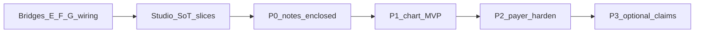

# ABA EMR — Artemis Replacement Roadmap (Enclosed Clinical System)

**Date:** 2026-08-11  
**Status:** Spec (product / architecture — operational guidance, not legal advice)  
**Product:** Rise & Shine — Simple RAS CRM + HRM  
**Related (do not duplicate):**
- **Master Artemis exit roadmap (Phase 0–4, role charters, dual-run):** [`2026-08-19-artemis-exit-enclosed-system-roadmap.md`](./2026-08-19-artemis-exit-enclosed-system-roadmap.md)
- Spine: [`2026-08-11-aba-crm-hrm-spine-roadmap.md`](./2026-08-11-aba-crm-hrm-spine-roadmap.md)
- Session-note SoT: [`2026-08-11-aba-session-note-data-collection-spec.md`](./2026-08-11-aba-session-note-data-collection-spec.md)
- Studio plan: [`2026-08-11-session-studio-implementation-plan.md`](./2026-08-11-session-studio-implementation-plan.md)
- Studio UX: [`2026-08-11-rbt-session-studio-design.md`](./2026-08-11-rbt-session-studio-design.md)
- Architecture: [`../../ARCHITECTURE.md`](../../ARCHITECTURE.md)

Billing stays a **manual Plutus tracker** through enclosed-EMR MVP. Claims/EDI is optional later (P3), not a cutover blocker.

---

## 1. Purpose / non-goals

### Purpose

Define what it takes for Rise & Shine to run a **fully enclosed ABA clinical EMR** in-house so clinical portal, session notes, client chart storage, programs/targets, and session delivery **stop depending on Artemis ABA** as system of record.

This doc answers: capability gaps vs Artemis-class tools, ownership (CRM vs HRM), compliance/payer checklist for NY multi-insurance, migration/dual-run, and phased build exit criteria.

### Non-goals

| Out of scope | Why |
|---|---|
| Implementing feature code in this change | Docs-only deliverable |
| Reopening HRM ATS / applicant cycle | Spine: COMPLETE; freeze |
| Contradicting session-note SoT | Extend & reference; SoT owns note fields/gates |
| Replacing Plutus as claim filer in MVP | Manual tracker by design (Slice C / Bridge F) |
| Legal advice / payer-contract interpretation | Operational product guidance only; contracts + counsel govern |
| Motivity training simulator replacement | `/rbt/simulation` stays separate (Studio design non-goal) |
| Inventing thick PRODUCT.md / BUILD.md content | LIBRARY: durable facts only; this is a dated roadmap |

---

## 2. Why leave Artemis (product framing)

| Pain | Effect today | Business risk |
|---|---|---|
| **PHI split-brain** | Client intake / PA / Case Coord live in RAS; clinical chart / notes / programs often still Artemis | Dual charts; wrong SoT under audit; staff double-enter |
| **Vendor lock** | RBT onboarding still tracks `artemisAccountSetup`; UI copy still says “log in Artemis” | Cannot control roadmap, pricing, or data export timing |
| **Workflow friction** | Clinical Support SOP still “schedule in Artemis”; RBT tasks cite Artemis 24-hour rule | Bridge F/G wiring exists in RAS while ops SOP points elsewhere |
| **Incomplete in-house chart** | `Client.treatmentPlan` JSON + `SkillTarget` models exist, but progress graphs / auth unit ledger / POS / structured notes are incomplete | Cannot cut over without clinical depth |
| **Fake “Artemis-grade” surfaces** | Supervision ratio hard-codes hours; EDI/clearinghouse UIs are aspirational stubs | False confidence; do not treat demos as cutover-ready |

**Repo evidence (honest):**

| Evidence | Path / fact |
|---|---|
| Schema still assumes Artemis onboarding | `RbtOnboarding.artemisAccountSetup` in `prisma/schema.prisma` |
| RBT confirm flows still Artemis | Historical HRM paths may remain; **CRM** RBT pipeline / clinical-support SOP / notes placeholders neutralized to RAS clinical chart + Plutus tracker (2026-08-11 Build B) |
| Clinical Support SOP | Was Artemis schedule/finalize — updated to RAS clinical chart + Plutus manual Treatment PA |
| RBT policy copy | Prefer RAS Session Studio / clinical chart wording in CRM surfaces; HRM Studio owns live session delivery |
| Schema comment | `prisma/schema.prisma`: “IN-HOUSE HRM & EVV MODELS (ARTEMIS HRM REPLACEMENT)” — intent exists; clinical cutover incomplete |
| Supervision UI partial | `BcbaSessionEmrTab.tsx`: ratio uses hardcoded `2` hours per session, not actual duration |
| SoT fields not yet in Prisma | `structuredContent`, `placeOfServiceCode`, signer timestamps — specified, not mirrored in live schema |

**Verdict:** Bridges E–G prove RAS can own activation → note sign → Plutus/payroll *wiring*. Artemis replacement fails until the **clinical chart + session delivery + supervision ledger** are honest SoT — not until EDI exists.

---

## Progress (2026-08-11)

**CRM integrity gates + SOP debt (Build B, no schema):** Billing/clinical `ClientStatus` writers now enforce predecessor checks via `apps/crm/src/lib/clientStatusGates.ts` (cannot skip VOB→PA→TP→Tx PA via direct action). Free writer `updateTreatmentPlanStatus` hard-gated. Fake Artemis confirm/SOP strings on CRM clinical-support, RBT pipeline, notes placeholder, and EMR tab copy redirected to **RAS clinical chart / Plutus manual tracker**. EDI clearinghouse UI labeled P3-optional stub — Plutus remains manual.

---

## 3. Target enclosed architecture

Preserve CRM/HRM split. Do **not** embed full clinical suite inside HRM or ATS inside CRM.

```text
┌─────────────────────────────────────────────────────────────────┐
│                     Shared Postgres (Prisma)                      │
│  Client chart · Auth/PA · Session · SessionNote · Targets · EVV │
└───────────────┬─────────────────────────────┬───────────────────┘
                │                             │
        ┌───────▼────────┐           ┌────────▼────────┐
        │   apps/crm     │           │   apps/hrm      │
        │ Clinical chart │           │ Session delivery│
        │ BCBA co-sign   │◄─notify──►│ RBT Studio      │
        │ Billing tracker│           │ Schedule / EVV  │
        │ Case Coord     │           │ Payroll (G)     │
        │ Parent magic   │           │ (ATS frozen)    │
        └───────┬────────┘           └─────────────────┘
                │
                │ manual handoff (MVP)
                ▼
        ┌───────────────┐
        │ Plutus (ext.) │  claims / remittance / AR
        └───────────────┘
```

| Layer | Owner | Responsibility |
|---|---|---|
| **Clinical chart SoT** | CRM | Demographics, diagnosis, guardians, insurance/auth, TP/goals, assessments, documents, care team, BCBA queues, deficiencies, re-auth packets |
| **Session delivery SoT** | HRM | RBT schedule, EVV clock, Session Studio data collection, note draft + RBT/caregiver sign |
| **Shared clinical entities** | DB | `Session`, `SessionNote`, `SkillTarget`, `BehaviorTarget`, `EVVLog`, `Authorization` / `PARequest` |
| **Plutus boundary** | External | File claims, post remits, payer follow-up — RAS exports claim-ready packets / tracker rows |
| **Notifications** | Shared | Cross-app handoffs (RBT signed → BCBA; BCBA signed → Billing) |

### Plutus boundary (explicit phases)

| Phase | RAS owns | Plutus owns |
|---|---|---|
| **P0–P1 (enclosed MVP)** | Claim-eligible note + units + POS + auth ref + checklist; `isConverted` / `plutusClaimRef` when entered | Actual claim submission, ERA, denial mgmt |
| **P2 (payer-hardening)** | Auth unit ledger, scrub rules, denial reason taxonomy mirrored for coaching | Still files claims |
| **P3 (optional)** | Native 837/835 or clearinghouse integration *if* product decision flips | Shrinks or exits |

Do not block Artemis clinical cutover on P3.

---

## 4. Capability matrix

Status legend: **HAVE** = durable production path · **PARTIAL** = model/UI exists but incomplete/fake/SOP still Artemis · **MISSING** = not real SoT.

| Capability | Artemis-class need | Status in RAS | Owner | Priority |
|---|---|---|---|---|
| Client demographics + guardians | Client 360 | **PARTIAL** — `Client` + guardian fields; no multi-guardian / ICD columns on Client | CRM | P1 |
| Diagnosis / medical necessity | ICD + eval docs | **PARTIAL** — intake form/docs; not first-class Client diagnosis model | CRM | P1 |
| Insurance / member / Medicaid IDs | Multi-payer | **PARTIAL** — `insurancePayer`, `memberId`, `medicaidId`; single payer row | CRM | P1 |
| Auth / PA by CPT units | Auth ledger | **PARTIAL** — `Authorization` + `AuthCptCode` + `PARequest`; CRM Billing tab shows authorized vs estimated remaining (session-duration 8-min rule). Claim-grade ledger / note `billableUnits` still P2. | CRM | P1–P2 |
| Treatment plan build + e-sign | TP + parent/BCBA sign | **PARTIAL** — `Client.treatmentPlan` JSON; typed-name signs; status wiring Slice B | CRM | P0–P1 |
| Programs / skill targets | Domain → target → mastery | **PARTIAL** — `SkillTarget` + measurement types; Studio may fall back to demo targets | CRM + HRM | P1 |
| Behavior plans / BRP targets | Behavior + ABC | **PARTIAL** — `BehaviorTarget` / `BehaviorLog`; ABC persist incomplete (Studio plan) | CRM + HRM | P1 |
| Progress graphs | Session → graphs | **MISSING** / stub — `phaseLines` JSON; `ReAuthCompilerDashboard` sample data | CRM | P1 |
| Assessments (97151) | Schedule + report | **PARTIAL** — assessment Session CPT; report assembly tabs; Spine ~3.5/10 schedule honesty | CRM | P1 |
| Session notes 97153 | Compliant note | **PARTIAL** — Studio + Bridge F; SoT structured fields not in schema yet | HRM→CRM | P0 |
| RBT data collection modalities | DTT/ABC/freq/dur/TA/interval | **PARTIAL** — DTT+ABC UI; full matrix LATER per SoT | HRM | P0–P1 |
| BCBA co-sign + deficiencies | Queue + bounce | **HAVE/PARTIAL** — `bcbaSigned`, `NoteDeficiency`; structured summary weak | CRM | P0 |
| Documents vault | Chart docs | **PARTIAL** — `Document` + intake uploads; clinical chart not unified EMR file browser | CRM | P1 |
| Care team assign | BCBA/RBT/CC | **PARTIAL** — `bcbaId`/`rbtId`/CC; multi-RBT roster weak (single `rbtId`) | CRM | P1 |
| Scheduling | Calendar conflicts | **PARTIAL** — `Session` + `ScheduleAppointment` dual models; Case Coord weekly grid | CRM | P1 |
| EVV clock in/out + GPS | Cures Act capture | **PARTIAL** — `EVVLog` + Studio clock; **no** state aggregator submit | HRM | P1–P2 |
| Cancel / no-show / make-up | Attendance integrity | **PARTIAL** — `CANCELLED`/`NO_SHOW` enums; make-up workflow MISSING | CRM + HRM | P1 |
| Protocol mod 97155 | Concurrent/supervisory note | **PARTIAL** — telehealth stub UI; SoT marks concurrent split LATER | CRM | P1–P2 |
| Caregiver training 97156 | Family guidance note | **MISSING** as durable CPT workflow | CRM | P2 |
| BACB supervision ratios | 5%/10%+ documentation | **PARTIAL** — UI exists; hours hardcoded (not audit-grade) | CRM | P1 |
| Staff credentials NPI/taxonomy | Rendering provider | **PARTIAL** — `StaffCredential` model; not enforced on note submit | HRM/CRM | P2 |
| Auth unit consumption | Prevent overbill | **MISSING** ledger | CRM | P2 |
| Parent portal (ongoing) | Schedule/messages/sign | **PARTIAL** — magic link intake + TP sign; not full parent app | CRM | P2 |
| Clinical quality queues | Deficiencies / aging notes | **PARTIAL** — deficiency model; aging/SLA dashboards thin | CRM | P1 |
| Claims / EDI / ERA | RCM automation | **MISSING** (stubs: `edi837Generator`, clearinghouse UI) — **stay Plutus** until P3 | Billing | P3 |
| AI note / AI TP draft | Artemis AI features | **PARTIAL** — `AiTreatmentPlanCopilot`; not cutover-critical | CRM | LATER |
| Audit trail PHI access | HIPAA accountability | **PARTIAL** — `AuditLogVault` model; not systematically wired | Shared | P1–P2 |

---

## 5. Compliance & multi-payer checklist

**Label:** operational product checklist for a NY ABA provider. Not legal advice. Payer manuals, Medicaid guidance, BACB ethics, and counsel prevail.

### 5.1 Clinical / documentation

| Requirement | In-house MUST | Notes |
|---|---|---|
| Medical necessity linked to TP goals | Note references ≥1 authorized goal/target | SoT §4 |
| 97153 narrative sections | Logistics, goals, data, procedures, response, barriers, caregiver, plan, signatures | SoT — not generic SOAP |
| 15-min units / 8-minute rule | Durable `billableUnits` on note | SoT §6 |
| Place of service | CMS POS code + label | `placeOfServiceCode` MUST |
| Rendering + supervising providers | RBT + BCBA on session/note | Credential enforcement P2 |
| Co-sign before claim-eligible | `rbtSigned && bcbaSigned` + checklist | Bridge F invariant |
| Deficiencies block convert | Open `NoteDeficiency` = 0 | SoT |
| Retention / export | Exportable chart + notes | Define retention SOP with counsel |

### 5.2 Supervision & BACB (ops)

| Requirement | Product need | Status |
|---|---|---|
| Documented supervision of RBT practice | 97155 sessions + notes; ratio dashboards from **actual** minutes | Fix hardcoded ratio (P1) |
| Protocol modification documentation | Structured 97155 note type | P1–P2 |
| Caregiver training | 97156 note workflow | P2 |
| Credential / cert expiry | `StaffCredential` alerts | P2 |

### 5.3 EVV / HIPAA

| Requirement | Product need | Status |
|---|---|---|
| Capture start/stop + location | `EVVLog` | PARTIAL |
| Submit to NY EVV aggregator (if applicable to service line) | Vendor/integration decision | OPEN (P2) |
| PHI access logging | Wire `AuditLogVault` on view/sign/export | P1–P2 |
| Minimize PHI in app logs | IDs only | Studio plan |

### 5.4 Multi-insurance / payer readiness (NY Medicaid + commercial)

| Item | In-house vs Plutus |
|---|---|
| Auth number, dates, units by CPT (97151/53/55/56/…) | **In-house** — BillingAuthTab `AuthUnitsPanel` (read existing models); full burn-down ledger P2 |
| Diagnosis ICD supporting ABA | **In-house** chart field + doc |
| NPI / taxonomy / Medicaid provider IDs on claim packet | **In-house** staff + org credentials → export to Plutus |
| POS, modifiers, units, rendering NPI | **In-house** on note/session header |
| Medical necessity narrative quality | **In-house** checklist (SoT) |
| Eligibility / VOB | Tracker today; real eligibility API LATER |
| Claim scrub / 837 / ERA / denials | **Plutus** through P2; optional RAS P3 |
| Common denial reasons (ops coaching) | Mirror codes in RAS for note QA: missing auth, POS mismatch, units > auth, unsigned, no medical necessity, credential inactive, timely filing |

---

## 6. Clinical chart information architecture (modules)

CRM client profile becomes the enclosed EMR chart. Modules map to tabs/queues — not a second product.

| Module | Contents | Primary surfaces |
|---|---|---|
| **A. Identity & demographics** | Name, DOB, sex, address, language, photo policy | Client header + intake |
| **B. Guardians & contacts** | Multi-guardian, custody, emergency | Extend beyond single `guardian*` |
| **C. Coverage** | Payers, member IDs, Medicaid, credentialing flags | BillingAuth + Client fields |
| **D. Authorizations** | Assessment + treatment PA; CPT unit balances | `Authorization` / `PARequest` + ledger (P2) |
| **E. Diagnosis & clinical summary** | ICD, diagnosing provider, eval date, comorbidities | First-class fields (not only form JSON) |
| **F. Documents** | Eval, Rx, IEP, consents, prior ABA, session PDFs | `Document` + vault UX |
| **G. Treatment plan** | Hours by CPT, locations, goals, BRP, signatures | `treatmentPlan` JSON → structured tables over time |
| **H. Programs & targets** | SkillTarget / BehaviorTarget library per client | CRM edit; HRM collect |
| **I. Assessments & reports** | 97151 events, report assembly, re-auth packets | Assessment + Report + `ReAuthPacket` |
| **J. Sessions & notes** | Schedule, attendance, notes, EVV summary | CRM view; HRM write Studio |
| **K. Supervision & quality** | Ratio ledger, 97155/97156, deficiencies | Clinical portal + EMR tab |
| **L. Care team & staffing** | BCBA, RBT(s), CC, openings | Assignments + CaseOpening (CRM) |
| **M. Messaging / parent** | ClientMessage; magic-link tasks | Portal — full parent app P2 |
| **N. Audit** | Who viewed/signed/exported | `AuditLogVault` |

HRM does **not** own modules A–G as SoT; it reads what Studio needs (targets, schedule, auth ref).

---

## 7. Relationship to session-note SoT + Studio plan

| Doc | Owns | This roadmap does |
|---|---|---|
| **Session-note SoT** | Note lifecycle, modalities, checklist, Bridge F/G invariants, MUST schema for notes | Reference only — no field redefinition |
| **Studio implementation plan** | Slices 0–N to close Studio gaps vs SoT | P0 prerequisite; complete before “enclosed notes MVP” |
| **Spine roadmap** | Intake→PA→Case Coord; Bridges E–G DONE for wiring | Clinical EMR phases **after** / **on top of** E–G |
| **This doc** | Full Artemis replacement: chart, delivery, compliance, migration, P0–P3 | Extends beyond notes into chart + cutover |

**Dependency order:**

```text
SoT + Studio slices (structured note honesty)
  → P0 enclosed notes SoT live (no Artemis note path)
  → P1 clinical chart MVP (targets, graphs, auth display, supervision honesty)
  → P2 payer-hardening (unit ledger, EVV submit decision, credentials)
  → P3 optional claims/EDI
```

Do **not** reopen ATS. Do **not** weaken Bridge F/G gates.

---

## 8. Migration / cutover plan (legacy EMR)

> **Strategy update (2026-08-19):** Cutover is **sandbox + cold turkey**, not dual-run. Production caseload stays on the external stack until a written go/no-go flip. Authoritative checklist: [`2026-08-11-ras-sandbox-cutover-checklist.md`](./2026-08-11-ras-sandbox-cutover-checklist.md).

### 8.1 Principle

**No parallel operation.** Prove readiness on pretend clients in RAS (2–3 week sandbox), then **cold cutover** when leadership signs go/no-go. Rollback = return to external production (operational parachute — not in RAS).

### 8.2 Cutover phases (replaces dual-run modes)

| Phase | RAS | Production caseload | Exit |
|---|---|---|---|
| **Sandbox** | Pretend clients; full workflow rehearsal | External stack | Studio QA green |
| **Cutover Readiness** | Sandbox at claim-ready depth | Still external | ≥10-note internal QA; Billing accepts RAS→Plutus |
| **Cold Cutover** | Flip real ACTIVE clients to RAS SoT | RAS for flipped cohort | Written go/no-go |
| **Enclosed Operations** | RAS SoT for all active care | RAS | Roadmap P1–P3 exits |
| **Decommission** | Historical PDF archive only | RAS | Contract exit |

### 8.3 Data import patterns

| Domain | Pattern | Caution |
|---|---|---|
| Clients already in RAS | Match on DOB + name + medicaid/member; do not duplicate | Intake spine owns Client id |
| Historical notes | PDF/attachment vault + optional structured import LATER | Prefer attachments first; structured parse is expensive |
| Programs/targets | CSV/API export → `SkillTarget` / `BehaviorTarget` | Map measurement types to SoT enums |
| Auths | Enter into `Authorization` / `PARequest` or import CSV | Align CPT unit totals before burn-down |
| Staff | Map Artemis users → `User` + `StaffCredential` | NPI required before P2 claims packet |

### 8.4 Cutover checklist (per cohort)

**Actionable go/no-go:** [`2026-08-11-ras-sandbox-cutover-checklist.md`](./2026-08-11-ras-sandbox-cutover-checklist.md) (Sandbox → Cutover Readiness → Cold Cutover / rollback). **Cutover strategy (2026-08-19):** sandbox + cold turkey — **not** dual-run or parallel operation with legacy EMR. Summary:

1. Cohort clients ACTIVE with durable `Session` path (Bridge E).  
2. Studio SoT slices applied (structuredContent, checklist, POS, units).  
3. BCBA co-sign queue used exclusively for cohort notes.  
4. Billing converts only RAS-signed notes (`isConverted` + Plutus ref).  
5. Payroll uses Bridge G from RAS notes.  
6. Artemis write access removed for cohort RBTs/BCBAs.  
7. SOP copy updated (remove Artemis strings in Clinical Support, RBT tasks, onboarding).  
8. `artemisAccountSetup` retired or renamed to `clinicalEmrAccess` (RAS).  
9. Historical Artemis PDFs attached under Documents.  
10. Audit sample: 10 notes pass internal checklist; counsel/compliance sign-off as needed.

Do **not** treat this list as “legacy EMR replaced” org-wide — that is decommission after all cohorts at Live.

---

## 9. Phased build roadmap (P0–P3)

### P0 — Notes SoT live; kill Artemis as note SoT

| Work | Exit criteria |
|---|---|
| Complete Studio implementation plan slices (schema MUST fields + structured submit + checklist gate) | SoT §8 fields in DB; convert rejects failed checklist |
| CRM BCBA queue shows structured summary | No prose-only sign-off for new notes |
| Remove Artemis as required note path for pilot cohort | RBT/BCBA SOP: RAS only for pilot |
| Strip misleading “confirm in Artemis” for pilot | Pipeline actions write RAS notes only |

**Exit:** Pilot cohort produces claim-ready notes end-to-end in RAS → Plutus tracker without Artemis documentation.

### P1 — Enclosed clinical EMR MVP

| Work | Exit criteria |
|---|---|
| Chart modules A–L usable for ACTIVE clients | BCBA works day without Artemis chart |
| Real SkillTarget/BehaviorTarget on every ACTIVE client (no demo targets for live) | Studio never needs demo goals for ACTIVE |
| Progress graphs from trial/behavior logs | Re-auth can show real trends (not sample dashboard) |
| Scheduling unified (`Session` SoT; deprecate dual fake calendars) | Cancel/no-show recorded; make-up linked |
| Supervision ratio from actual session minutes | No hardcoded hours |
| Documents vault as chart home | Eval/TP/notes PDFs findable |
| Dual-run D1→D2 for expansion cohorts | Artemis write off for ≥1 full caseload |

**Exit:** Clinical leadership signs: “We can operate enclosed for ACTIVE clients.” Billing still Plutus manual.

### P2 — Payer-hardening

| Work | Exit criteria |
|---|---|
| Auth unit ledger vs scheduled/completed units | Over-auth blocked or warned |
| StaffCredential enforced on submit/sign | Missing NPI/Medicaid ID blocks claim-ready |
| EVV aggregator decision implemented or explicitly deferred with risk accept | Written decision in Risks |
| 97155/97156 durable note types | Supervision + parent training billable paths |
| AuditLogVault on PHI view/sign/export | Spot-check passes |
| Denial-reason coaching on checklist | Top denial codes mapped to blockers |

**Exit:** Internal audit sample meets multi-payer packet quality; Plutus still files.

### P3 — Optional claims / EDI (non-blocking)

| Work | Exit criteria |
|---|---|
| Product decision: stay Plutus vs native 837/835 | Written decision |
| If native: replace stubs with real clearinghouse pipeline | ERA post + denial loop |
| If stay Plutus: harden export packet only | Stable claim packet API/CSV |

**Exit:** Either RAS claims live **or** explicit permanent Plutus boundary.



---

## 10. Risks & open decisions

| Risk / decision | Options | Recommendation |
|---|---|---|
| **EVV vendor / NY aggregator** | Build vs vendor vs Plutus-adjacent | Decide before P2 exit; capture GPS now either way |
| **Claims ownership** | Forever Plutus vs RAS EDI | Default: Plutus through P2; revisit P3 |
| **Parent app** | Magic-link only vs native parent portal | Magic-link + messages through P1; parent app P2+ |
| **Multi-RBT per client** | Keep single `Client.rbtId` vs assignment table | Need assignment table for real caseloads (P1) |
| **TP storage** | Keep JSON vs normalize goals tables | JSON OK for P0; normalize when graphs/re-auth demand (P1) |
| **AI notes** | Build vs skip | Non-blocking; Artemis AI is convenience, not cutover gate |
| **Historical structured import** | Full parse vs PDF archive | PDF archive first; structured only if audit demands |
| **Telehealth 97155** | WebRTC product vs external Zoom + note | Prefer durable note + EVV; video vendor optional |
| **SOP / UI Artemis debt** | Leave strings vs purge | Purge as each cohort cuts over — leftover strings sabotage training |
| **Compliance ownership** | Who signs clinical SoT changes | Name Clinical Director + Billing lead as approvers |

---

## 11. Appendix — candidate schema modules

Names only. Align note fields with SoT (do not fork). **Do not** run migrate/db push from agents.

### MUST (enclosed MVP — additive to SoT MUST)

| Module / entity | Purpose |
|---|---|
| SoT `SessionNote.*` structured fields | Already specified — implement first |
| `Session.placeOfServiceCode` + `IN_PROGRESS` | SoT |
| `ClientDiagnosis` (or Client ICD fields) | First-class diagnosis |
| `ClientGuardian` (1:n) | Multi-guardian |
| `ClientStaffAssignment` | Multi-RBT/BCBA history |
| `AuthUnitLedger` / burn-down view | Units remaining by CPT |
| Wire `AuditLogVault` writes | PHI accountability |

### LATER

| Module / entity | Purpose |
|---|---|
| `SessionNoteAuditEvent` | Append-only clinical audit |
| `MakeupSession` link | Cancel → makeup |
| `EvvSubmission` | Aggregator batch status |
| `Claim` / `ClaimLine` / `Remittance` | Only if P3 native RCM |
| Assessment instrument scores (VB-MAPP etc.) | Structured assessment library |
| Rename `RbtOnboarding.artemisAccountSetup` → `clinicalEmrProvisioned` | Kill Artemis naming |

### Optional SQL stubs

Prefer implementing SoT SQL from [`2026-08-11-aba-session-note-data-collection-spec.md`](./2026-08-11-aba-session-note-data-collection-spec.md) §8.4 first (canonical). Additional EMR modules get their own `docs/sql/YYYY-MM-DD-HHmmssZ-slug.sql` file using the real current UTC timestamp when build starts — **not** invented here as thick DDL.

Example naming only (no apply):

- `docs/sql/2026-08-11-session-note-structured-fields.sql` — SoT MUST  
- `docs/sql/YYYY-MM-DD-HHmmssZ-client-diagnosis-guardians.sql` — P1 chart
- `docs/sql/YYYY-MM-DD-HHmmssZ-auth-unit-ledger.sql` — P2

---

## Index pointers

When this roadmap is active, also see from:

- `docs/ARCHITECTURE.md` — Artemis replacement roadmap link  
- `docs/README.md` — specs table  
- `.agents/skills/crm-app-map` / `hrm-app-map` — Also see one-liners  
