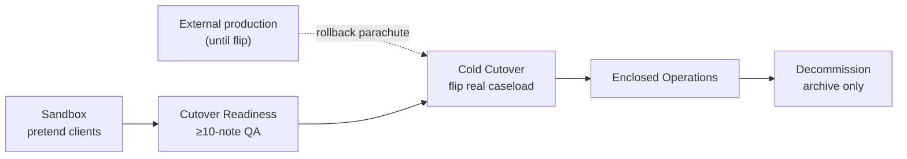

# RAS Sandbox → Cold Cutover Checklist

**Date:** 2026-08-11 (revised 2026-09-12)
**Status:** Operational go/no-go (ops / clinical leadership — not legal advice)
**Product:** Rise & Shine — Simple RAS CRM + HRM
**Spine owner:** [`2026-08-11-aba-emr-artemis-replacement-roadmap.md`](./2026-08-11-aba-emr-artemis-replacement-roadmap.md) §8

**Strategy (2026-08-19):** RAS is a **strictly enclosed** system. There is **no dual-run**, **no shadow billing**, and **no in-app reconciliation** against a legacy EMR. Production caseload stays on the friend's CRM+HRM stack until a **cold cutover** flip. RAS pilot work uses **pretend / sandbox clients** for 2–3 weeks, then leadership executes cutover when ready. Rollback = return to the external production stack (operational parachute — not a RAS product workflow).

**Related (do not duplicate):**
- Master cutover phases → [`2026-08-19-artemis-exit-enclosed-system-roadmap.md`](./2026-08-19-artemis-exit-enclosed-system-roadmap.md) §5
- Note fields / Bridge F–G invariants → [`2026-08-11-aba-session-note-data-collection-spec.md`](./2026-08-11-aba-session-note-data-collection-spec.md)
- Studio build readiness → [`2026-08-11-session-studio-implementation-plan.md`](./2026-08-11-session-studio-implementation-plan.md)
- Wiring click-paths → [`2026-08-11-bridge-efg-manual-qa-checklist.md`](./2026-08-11-bridge-efg-manual-qa-checklist.md)
- Connected smoke → [`2026-08-11-connected-product-test-playbook.md`](./2026-08-11-connected-product-test-playbook.md)

**Hard rule:** This checklist does **not** claim org-wide legacy EMR replacement until **Decommission** (historical archive only). First success = one sandbox cohort passes **Cutover Readiness** gates and leadership signs **Cold Cutover** go/no-go.

---

## Cutover phases (replaces D0/D1/D2 dual-run)

| Phase | RAS role | Production caseload | Promotion gate |
|-------|----------|---------------------|----------------|
| **Sandbox** | Pretend clients only; full workflow rehearsal | External stack (friend CRM+HRM) | Studio QA green; Bridges E–G smoke; cohort roster recorded |
| **Cutover Readiness** | Sandbox cohort at full claim-ready depth | Still external | ≥10-note internal QA sample; Billing accepts RAS→Plutus |
| **Cold Cutover** | Flip real ACTIVE clients to RAS SoT | **RAS only** for flipped cohort | Written go/no-go; rollback plan rehearsed |
| **Enclosed Operations** | RAS SoT for all active care | RAS | Phase 0–3 roadmap exits met per domain |
| **Decommission legacy EMR** | Historical PDF archive only | RAS | Contract exit; accounts disabled |

---

## 0. Product reality snapshot

Use this to judge go/no-go — do not invent readiness from aspirational UI.

| Area | Reality today | Cutover implication |
|------|---------------|---------------------|
| **Bridges E–G** | **DONE** (wiring) | Re-run [Bridge E–F–G QA](./2026-08-11-bridge-efg-manual-qa-checklist.md) on sandbox sample |
| **Session Studio depth** | Slices 0–8 landed in code | Still prove the claim-ready path manually for the cohort CPT mix |
| **Chart Progress** | Durable trial/behavior aggregates are wired | Requires clinical acceptance on pretend ACTIVE clients |
| **Auth units** | Server-side ledger and convert hard stop are wired | Requires target-database and billing acceptance evidence |
| **Plutus** | Manual tracker by design | Stay Plutus through cutover |
| **Production caseload** | External stack until cold flip | Sandbox uses pretend clients — never dual-document real DOS |

---

## How to use this doc

1. Name a **sandbox cohort** (pretend client list + assigned RBT/BCBA IDs) and fill the header table.
2. Complete **Phase A** (sandbox readiness) before expanding beyond pretend clients.
3. Record promotion **Sandbox → Cutover Ready → Live** on this controlled cohort sheet; the retired `/portal-billing/audit` worksheet is not a product dependency.
4. Check every box in the **current** phase before promoting.
5. **Cold Cutover** requires written leadership go/no-go — not an in-app button.
6. Keep **Phase C** (rollback to external production) printed with the cohort sheet; rehearse once before cutover.
7. One copy per sandbox cohort. Do not invent product pages from this runbook.

| Field | Value |
|-------|-------|
| Cohort name / ID | |
| Sandbox client IDs (pretend) | |
| RBT / BCBA roster | |
| Clinical owner | |
| Billing owner | |
| Eng / Studio owner | |
| Target sandbox start | |
| Target cutover readiness | |
| Target cold cutover date | |
| Sign-off date | |
| Go / No-go (Clinical) | ☐ GO ☐ NO-GO |
| Go / No-go (Billing) | ☐ GO ☐ NO-GO |

---

## Phase A — Sandbox readiness (must pass before Cutover Readiness)

**Goal:** Prove RAS can own the full note→sign→convert path on **pretend clients** without touching production caseload documentation.

### A1 — Wiring & environment (go/no-go)

- [ ] Bridge E–F–G manual QA green on **≥1** sandbox client within 14 days of sandbox start.
- [ ] Sandbox clients **ACTIVE** via durable non-`97151` `Session` (Bridge E).
- [ ] RBT + BCBA assigned; Bridge G payroll path known for those staff.
- [ ] Session-note structured SQL applied in Supabase if cohort will produce Slice 1+ notes.
- [ ] Studio plan slices required for cohort CPT mix marked done.
- [ ] Plutus handoff owner agrees RAS-signed notes are the **packet source** for sandbox DOS (manual tracker OK).
- [ ] Chart Progress + Auth units panels available on sandbox client profiles.

**NO-GO if any A1 box fails.** Fix product; do not advance phase.

### A2 — Sandbox clinical acceptance (Sandbox exit → Cutover Readiness)

- [ ] RBTs open Session Studio for scheduled RAS `Session`s (pretend clients only).
- [ ] BCBA can review queue; claim-ready only after `rbtSigned && bcbaSigned` (+ checklist when Slice 3 live).
- [ ] Open `NoteDeficiency` blocks convert (Bridge F).
- [ ] Known Studio defects logged; **zero** severity blockers listed as open.
- [ ] **No production caseload** documented in RAS during sandbox unless explicitly part of cold cutover (post go/no-go).

**Promote to Cutover Readiness when:** Clinical owner signs A2; Eng confirms Studio depth for cohort CPT.

### A3 — Internal QA operating rules (Cutover Readiness phase)

| Rule | Expectation |
|------|-------------|
| Documentation | RAS Session Studio only (sandbox / flipped cohort) |
| Billing packet | Convert only RAS-signed notes → Plutus ref |
| Payroll | Bridge G from RAS notes |
| QA sample | **≥10** notes pass internal checklist (gate 10) |
| Discrepancies | Flag in worksheet; resolve before cold cutover sign-off |

---

## Sandbox week script (engineering runbook)

Use **after Phase 0 security gates are green** and session-note structured SQL is applied. **Pretend clients only** until cold cutover go/no-go.

| Day | Owner | Action | Pass |
|-----|-------|--------|------|
| 1 | Ops | Verify the target against the canonical [`docs/sql/README.md`](../../sql/README.md); pick 3–8 **pretend** ACTIVE clients + RBT/BCBA roster | Database evidence and cohort header filled |
| 1 | Eng | DevTools seed or real schedule path; run Bridge E–F–G QA on one twin client | Bridge checklist smoke green |
| 2–7 | Clinical | RBT: HRM schedule → EVV → Session Studio (real SkillTargets — **no demo t1/b1 on ACTIVE**) | Claim-ready submit succeeds |
| 2–7 | BCBA | CRM `/portal-clinical/daily` e-sign; zero open deficiencies | `bcbaSigned=true` |
| 2–7 | Billing | `/notes` convert (manual Plutus ref); record each reviewed note ID and outcome on the controlled cohort sheet | ≥10 reviewed, 0 open discrepancies |
| 7 | Ops + Clinical | Sign **Cutover Ready** on the controlled cohort sheet | Cutover Readiness boxes signed |
| 7+ | Leadership | Schedule **Cold Cutover** only after gate 10 + Billing accept RAS→Plutus | Written go/no-go on cohort sheet |

**Product surfaces:** HRM Session Studio and payroll; CRM clinical review, `/notes`, billing/client charts, and `/ops`. The QA roster and sign-off are controlled operational evidence outside RAS; there is no in-app dual-run/audit worksheet. Before real-client activation, run the repository verifier as `node scripts/verify-no-demo-data.mjs` (there is no npm alias).

---

## Cold Cutover — go/no-go (leadership)

**Goal:** Flip real production caseload from external stack to RAS SoT in one coordinated event. **Not** gradual dual-operation.

### Pre-cutover gates

- [ ] Cutover Readiness signed (≥10-note QA, zero open discrepancies).
- [ ] Production-readiness Phase 1 blockers closed (auth, PHI storage).
- [ ] Real `SkillTarget`/`BehaviorTarget` on clients being flipped.
- [ ] Staff trained on RAS-only SOP; no legacy EMR strings in product copy.
- [ ] Rollback plan rehearsed (Phase C).
- [ ] Historical legacy PDFs imported to client document vault where needed.

### Cutover day

- [ ] Written Clinical + Billing + Ops **GO** (timestamped).
- [ ] External production stack marked read-only for flipped clients (operational — outside RAS).
- [ ] Cohort marked **Live** on the controlled operational roster.
- [ ] Spot-check: new DOS documented only in Session Studio.
- [ ] Billing converts only RAS-signed notes for flipped DOS.

**Do not** cold-cutover without written go/no-go. Expand to additional cohorts only after first flip stabilizes (1–2 weeks).

---

## Phase C — Rollback (external production parachute)

Use when sandbox QA fails, RAS outage blocks care, or cold cutover was premature. Rollback is **operational** — return caseload documentation to the external production stack. RAS does not implement dual-write or legacy EMR sync.

| Trigger | Action | Owner |
|---------|--------|-------|
| QA sample fails (<10 pass or open discrepancies) | Stay in Sandbox / Cutover Readiness; fix RAS defects; re-run sample | Clinical + Eng |
| RAS outage during Live ops | Temporary return to external production per written exception: DOS list, expiry, re-import plan into RAS | Clinical + Billing + IT |
| Billing packet error | Halt convert; reconcile before Plutus file | Billing |
| Accidental premature cutover | Written Clinical + Billing decision; treat as rollback event | Leadership |

### Rollback checklist

- [ ] **Do not** resume external production documentation casually after Live without Clinical + Billing written decision.
- [ ] If QA fails: remain in sandbox phase; fix defects; re-run 10-note sample.
- [ ] If RAS outage during Live: external production write requires named exception, DOS list, and re-import plan before closing exception.
- [ ] After rollback, re-enter at correct phase (usually Cutover Readiness); do not skip QA gates.

---

## Per-cohort gate summary

| # | Gate | Owner | Done |
|---|------|-------|------|
| 1 | Sandbox clients ACTIVE with durable `Session` path (Bridge E) | Case Coord / Clinical | [ ] |
| 2 | Studio SoT depth live for notes cohort produces (+ SQL applied) | Eng / Clinical | [ ] |
| 3 | BCBA co-sign queue used for cohort notes | BCBA lead | [ ] |
| 4 | Billing converts only RAS-signed notes → Plutus ref (manual) | Billing | [ ] |
| 5 | Payroll uses Bridge G from RAS notes | HR / Payroll | [ ] |
| 6 | Cold cutover go/no-go signed (if flipping real caseload) | Leadership | [ ] |
| 7 | SOP copy aligned (no legacy EMR training strings in RAS) | Clinical ops | [ ] |
| 8 | `clinicalEmrProvisioned` rename applied in Supabase | Eng / HR | [ ] |
| 9 | Historical legacy PDFs under Documents | Clinical / CC | [ ] |
| 10 | Internal QA sample ≥10 notes + compliance sign-off as needed | Clinical + Billing | [ ] |

---

## Explicit non-blockers

| Item | Why not a cutover gate |
|------|------------------------|
| P3 claims / EDI / clearinghouse | Plutus files claims through P2 |
| Full structured historical note parse | PDF vault first |
| Claim-grade auth unit ledger | Display enough for sandbox ops; ledger is P2 |
| Org-wide legacy vendor contract exit | Decommission phase only |
| Parent app beyond magic-link | P2+ |
| AI note drafting | Convenience, not SoT |

---

## Phase 2 — Enclosed Clinical EMR acceptance (sandbox QA)

Use after Phase 1 notes + EVV gates are green. Goal: BCBA can work a full clinical day on **pretend ACTIVE clients** without legacy EMR login.

| # | Check | Pass |
|---|-------|------|
| P2-1 | Clinical Goals → **Sync targets to Session Studio** creates real `SkillTarget` / `BehaviorTarget` UUIDs (not demo t1/b1) | [ ] |
| P2-2 | HRM Session Studio loads CRM SkillTargets on ACTIVE sandbox client; claim-ready blocked if demo ids used | [ ] |
| P2-3 | Client profile **Chart Progress** shows trial aggregates from `SessionTrialData` / `BehaviorLog` (honest empty when none) | [ ] |
| P2-4 | Assessment tab persists **97151 Session** + `treatmentPlan.assessmentScheduledAt`; reconcile banner if mismatch | [ ] |
| P2-5 | BCBA EMR **97153/97155 service mix** ratio uses actual session minutes (not scheduled guess) | [ ] |
| P2-6 | Billing tab **T-45 banner** + Re-Auth Compiler opens when auth ≤45 days; packet uses live progress | [ ] |
| P2-7 | Supervision Compliance dashboard (`/portal-clinical`) reflects month-to-date 97153 vs 97155 minutes | [ ] |

**Phase 2 exit:** Clinical Director signs: enclosed chart usable for sandbox ACTIVE cohort. Proceed to cold cutover readiness (≥10-note QA) — not org-wide legacy EMR off (Phase 4).

---

## Phase 3 — Billing enclosed acceptance (sandbox QA)

Use after Phase 2 chart gates are green. Goal: RAS owns everything through Plutus handoff — scrub, auth ledger, credentials, export.

| # | Check | Pass |
|---|-------|------|
| P3-1 | Auth CPT unit ledger hard-stop at convert — over-auth blocked; BILLING/FINANCE/CEO override requires audited reason | [ ] |
| P3-2 | `/notes` ready queue shows auth-unit badge + blockers **before** convert click | [ ] |
| P3-3 | Expired/missing RBT or BCBA `BACB_LICENSE` blocks claim-ready Studio submit on **ACTIVE** clients | [ ] |
| P3-4 | Same credential hard-stop blocks BCBA e-sign on ACTIVE clients (`CREDENTIAL_HARD_STOP`) | [ ] |
| P3-5 | Same credential hard-stop blocks Plutus convert on ACTIVE clients | [ ] |
| P3-6 | Claim scrubber runs pre-convert; BLOCKING defects disable convert + show on note card | [ ] |
| P3-7 | Denial playbook hints visible on `/portal-billing` and `/notes` (read-only, no EDI) | [ ] |
| P3-8 | **Export Plutus CSV** from handoff board — client ID, CPT, units, DOS, auth #, RBT/BCBA NPI, `plutusClaimRef` | [ ] |
| P3-9 | Zero packets sourced from legacy EMR — convert only RAS-signed notes with checklist snapshot | [ ] |
| P3-10 | EDI 837 preview remains dev-flagged only; production filing stays in Plutus | [ ] |

**Phase 3 exit:** Billing lead signs: "Plutus receives complete packets from RAS only."

---

## Index pointers

- `docs/README.md` — specs table
- `docs/ARCHITECTURE.md` — sandbox cutover checklist link
- CRM DevTools (gated `NEXT_PUBLIC_ENABLE_DEV_TOOLS`) — checklist doc path
- `.agents/skills/crm-app-map` / `hrm-app-map` — Also see one-liners
