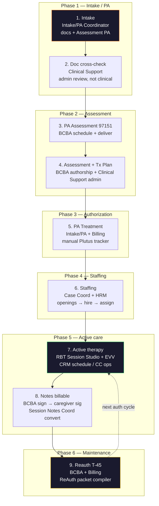
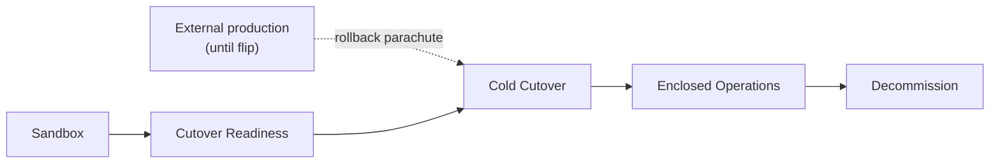
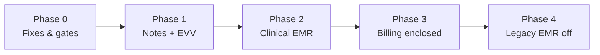

# Artemis Exit & Enclosed System Roadmap

**Date:** 2026-08-19
**Status:** Spec (master product roadmap — operational guidance, not legal advice)
**Product:** Rise & Shine — Simple RAS CRM + HRM
**Audience:** Clinical ops, engineering, billing, leadership

**Related (do not duplicate — link and extend):**

| Doc | Owns |
|-----|------|
| [`2026-08-11-aba-crm-hrm-spine-roadmap.md`](./2026-08-11-aba-crm-hrm-spine-roadmap.md) | Intake→PA→Case Coord sequencing; Bridges E–G |
| [`2026-08-11-aba-emr-artemis-replacement-roadmap.md`](./2026-08-11-aba-emr-artemis-replacement-roadmap.md) | Clinical EMR capability matrix, chart modules, P0–P3 clinical phases |
| [`2026-08-11-ras-sandbox-cutover-checklist.md`](./2026-08-11-ras-sandbox-cutover-checklist.md) | Per-cohort sandbox → cold cutover go/no-go |
| [`2026-08-11-aba-session-note-data-collection-spec.md`](./2026-08-11-aba-session-note-data-collection-spec.md) | Session-note clinical SoT (fields, checklist, Bridge F/G invariants) |
| [`2026-08-11-session-studio-implementation-plan.md`](./2026-08-11-session-studio-implementation-plan.md) | HRM Session Studio build slices |
| [`2026-08-12-production-readiness-gap-analysis.md`](./2026-08-12-production-readiness-gap-analysis.md) | Security, auth, demo quarantine blockers |
| [`../../ARCHITECTURE.md`](../../ARCHITECTURE.md) | CRM vs HRM ownership, SQL convention |

**This doc owns:** org-wide **legacy EMR exit definition of done**, the **9-phase end-to-end workflow**, **role charters mapped to portals**, **domain-by-domain enclosed-system state**, **sandbox + cold cutover strategy**, and **Phase 0–4 sequencing** across intake through decommission. Clinical field rules remain in the session-note SoT.

---

## 1. Executive summary — Artemis exit definition of done

**Vision:** Rise & Shine operates as a **fully enclosed system** — intake, clinical support, BCBA chart, session notes, EVV, scheduling, case coordination, and billing handoff all live in RAS (CRM + HRM). **Zero dependency on Artemis ABA** as system of record. **Plutus Health** remains the external claim filer through Phase 3; RAS produces claim-ready packets and tracks conversion.

### Definition of done (org-wide, enclosed operations)

Legacy EMR exit is complete when **all** of the following are true:

| # | Criterion | Evidence |
|---|-----------|----------|
| 1 | **No legacy EMR write path** for any active caseload | All cohorts at **Live** per sandbox cutover checklist |
| 2 | **RBT session notes** authored entirely in HRM Session Studio | No legacy note SoT for new DOS |
| 3 | **BCBA co-sign + deficiency queue** in CRM is exclusive clinical gate before billing | Bridge F invariant holds org-wide |
| 4 | **Clinical chart** (programs, targets, TP, assessments, documents) usable without legacy EMR login | EMR replacement roadmap P1 exit met |
| 5 | **EVV capture** in RAS for all billable direct service | Clock-in/out + location on `Session`/`EVVLog` |
| 6 | **Plutus handoff** from RAS-signed notes only | `isConverted` + `plutusClaimRef`; no mixed-source packets |
| 7 | **Intake→ACTIVE→reauth** walkable in RAS with honest `ClientStatus` transitions | Spine + FlowMap match enum |
| 8 | **SOP + product copy** contain no legacy EMR training strings | Onboarding, Clinical Support, RBT tasks |
| 9 | **Historical legacy exports** archived in client document vault | PDF attachments per cohort |
| 10 | **Contract / vendor offboarding** complete | Legacy accounts disabled org-wide |

**Not required for exit:** native 837/835 claims (Plutus stays filer), Motivity-style training simulator parity, or cloning polish from third-party CRM demos.

**Honest ceiling today (2026-08-19):** Bridges E–G wiring is **DONE**; enclosed notes + chart are **in progress**; org-wide legacy EMR exit is **not** achievable until Phase 1–2 complete and at least one sandbox cohort passes cutover readiness. See [production-readiness gap analysis](./2026-08-12-production-readiness-gap-analysis.md) for security/auth blockers that must close before any live cohort.

---

## 2. End-to-end workflow (9 phases)

Operational spine from inquiry through reauthorization. Status enum authority: `.agents/skills/intake-workflow-map/SKILL.md`.



### Phase → `ClientStatus` mapping (approximate)

| Workflow phase | Primary owner | Typical status range |
|----------------|---------------|----------------------|
| 1 Intake | Intake/PA | `INQUIRY` → `DOCS_APPROVED_INTAKE` |
| 2 Doc cross-check | Clinical Support | → `CLINICAL_REVIEW_APPROVED` |
| 3 Assessment PA | Intake/PA + Billing | `VOB_COMPLETED` → `PA_APPROVED` |
| 4 Assessment + TP | BCBA + Clinical Support | `ASSESSMENT_SCHEDULED` → `REPORT_ASSEMBLED` |
| 5 Treatment PA | Intake/PA + Billing | `TX_PA_SUBMITTED` → `TX_PA_APPROVED` |
| 6 Staffing | Case Coord + HRM | → `STAFFING_PENDING` |
| 7 Active therapy | RBT + BCBA + CC | → `ACTIVE` (Bridge E: durable first `Session`) |
| 8 Notes billable | BCBA + Notes Coord | ongoing `ACTIVE` |
| 9 Reauth T-45 | BCBA + Billing | `ACTIVE` (auth renewal cycle) |

---

## 3. Role charter → RAS portals & routes

SOP roles mapped to **Prisma `Role` enum**, default landing routes (`apps/crm/src/app/page.tsx`), and **hard boundaries**. Leadership roles (`CEO`, `CLINICAL_DIRECTOR`, `OPS_DIRECTOR`) inherit broad read access but must respect domain boundaries in SOP.

| SOP role | Prisma role(s) | Primary portal / route | Owns | Must NOT |
|----------|----------------|------------------------|------|----------|
| **Intake / PA Coordinator** | `INTAKE_PA_COORDINATOR` | `/portal-case` | Magic link, doc collection, VOB, Assessment/Treatment PA **tracker** (manual Plutus), status through PA gates | Clinical judgment, TP authorship, note conversion, BCBA assign without gates |
| **Clinical Support** | `CLINICAL_SUPPORT` | `/clinical-support` | Doc cross-check, assessment **scheduling admin**, parent TP sign facilitation, BCBA queue hygiene | Clinical decisions, PA submission ownership, note content edits, Plutus convert |
| **Case Coordinator** | `CASE_COORDINATOR` | `/portal-case-coord` | SPOC, readiness checklist, openings marketplace, parent accept, weekly schedule grid, caregiver onboarding | PA submission, note **conversion** (verify-only if routed), clinical note authorship |
| **Session Notes Coordinator** | `BILLING`, `CASE_COORDINATOR` (SOP) | `/notes` (`NotesPipelineClient`, `PlutusHandoffQueue`) | Verify checklist, route deficiencies, **convert** to Plutus ref — IDs/fingerprints only | Edit clinical note content, BCBA sign, PA submission |
| **BCBA** | `BCBA` | `/portal-clinical`, client profile EMR tabs | TP, programs/targets, assessment reports, co-sign, deficiencies, 97155/97156 authorship | Intake PA filing, Plutus convert, HR hire |
| **Clinical Director** | `CLINICAL_DIRECTOR` | `/portal-clinical`, `/ops` (read) | Oversight, assign BCBA, metrics, deficiency escalation | Replace BCBA clinical authorship on notes |
| **Billing** | `BILLING`, `FINANCE` | `/portal-billing`, `/notes` convert | Plutus tracker, auth display, denial coaching, reauth packet billing sections | Clinical edits, intake doc approval |
| **Ops Director** | `OPS_DIRECTOR` | `/ops` | Cross-domain seams, weekly ops metrics, audit samples, sandbox cutover coordination | Clinical decisions, note content, PA clinical narrative |
| **RBT** | `RBT` (HRM) | HRM `/rbt/session`, schedule | Session Studio data collection, EVV clock, RBT + caregiver sign | Client status, PA, convert, BCBA sign |
| **HR / Head HR** | `HR`, `HEAD_HR`, `HR_AGENT` (HRM) | HRM `/ats`, `/rbt/*` | Applicant cycle, hire → `User`, onboarding, job board apply | Client clinical status, Case Coord readiness |

**Gap:** No dedicated `SESSION_NOTES_COORDINATOR` enum yet. SOP role maps to `/notes` with `PLUTUS_TRACKER_ROLES` + convert actions; consider a future role flag when convert vs CC SPOC duties must hard-separate.

**Auth guards:** `apps/crm/src/lib/auth-guard.ts` — every server action gates via `requireStaff(roles?)` / `requireClientAccess(clientId)`; HRM mirror at `apps/hrm/src/lib/auth-guard.ts`.

---

## 4. System domains

For each domain: **current state**, **Artemis dependency**, **target enclosed state**, **key modules**, **acceptance criteria**.

---

### 4.1 Intake

| | |
|---|---|
| **Current state** | Magic-link continuous intake, doc uploads, FlowMap, Intake portal queue. Spine ~7–8/10 for intake→manual PA. `apps/crm/src/app/magic-link/`, `portal-case/`, `components/magic-link/`. |
| **Artemis dependency** | **None** for intake itself — RAS already SoT for inquiry through doc approval. Risk: staff habit of creating duplicate client in Artemis post-intake. |
| **Target state** | Single client record in RAS from inquiry; parent notifications in-app (`clientNotificationActions`, `ClientNotificationBell`); no parallel Artemis client creation SOP. |
| **Key modules** | `apps/crm/src/app/(dashboard)/portal-case/` · `apps/crm/src/app/magic-link/` · `apps/crm/src/components/magic-link/` · `apps/crm/src/app/actions/intake.ts` · `apps/crm/src/lib/intakeAddressPrivacy.ts` · `apps/crm/src/lib/magicLinkGuard.ts` · `.agents/skills/intake-workflow-map/SKILL.md` |
| **Acceptance criteria** | Walk `INQUIRY`→`DOCS_APPROVED_INTAKE` without Artemis; all PHI docs in private `client-documents` bucket; Intake/PA cannot advance clinical review without doc gates; parent portal notifications durable (SQL: `docs/sql/2026-08-19-182500Z-client-portal-notifications.sql`). |

---

### 4.2 Clinical Support

| | |
|---|---|
| **Current state** | `/clinical-support` queue; admin around assessment scheduling and doc completeness. PARTIAL — some action paths duplicate intake/clinical routes. |
| **Artemis dependency** | **Low** after Build B (2026-08-11) — SOP strings redirected to RAS chart. Residual risk: staff still schedule assessment blocks in Artemis out of habit. |
| **Target state** | Assessment datetime persisted on RAS `Session` (97151); handoff to BCBA queue without Artemis login; Clinical Support never edits TP clinical narrative. |
| **Key modules** | `apps/crm/src/app/(dashboard)/clinical-support/` · `apps/crm/src/app/(dashboard)/portal-case/actions/` · `apps/crm/src/components/client-profile/tabs/IntakeDocumentsTab.tsx` · `apps/crm/src/lib/clientStatusGates.ts` |
| **Acceptance criteria** | Clinical Support actions cannot set `ClientStatus` beyond admin gates; assessment schedule visible on client profile; zero Artemis strings in Clinical Support SOP copy; no clinical judgment fields writable by `CLINICAL_SUPPORT` role. |

---

### 4.3 Case Coordination

| | |
|---|---|
| **Current state** | `/portal-case-coord` — readiness checklist, openings, parent accept, weekly grid. Bridge E DONE (first session→`ACTIVE`). BRIDGE_V1 job board to HRM. ~4.5/10 pre-ACTIVE honesty per spine. |
| **Artemis dependency** | **Medium** — staffing complete in RAS but ongoing schedule/attendance sometimes mirrored in Artemis. |
| **Target state** | CC is SPOC for ACTIVE clients: schedule, attendance, caregiver comms, reauth triggers — all in RAS. Openings → HRM apply → assign `Client.rbtId` / future multi-RBT assignment table. |
| **Key modules** | `apps/crm/src/app/(dashboard)/portal-case-coord/` · `apps/crm/src/components/portal-case-coord/` · `apps/crm/src/app/actions/caseOpeningActions.ts` · `apps/crm/src/app/actions/firstSessionActions.ts` · `apps/crm/src/lib/schedulingConcurrencyEngine.ts` · `apps/crm/src/lib/sessionCancellationCoordinator.ts` · HRM `caseOpeningActions.ts`, `staffingActions.ts` |
| **Acceptance criteria** | `ACTIVE` only after durable non-97151 `Session` (Bridge E); CC cannot convert notes or submit PA; readiness checklist gates `STAFFING_PENDING`→opening post; attendance scorecard / cancel-no-show recorded in RAS. |

---

### 4.4 Clinical / BCBA

| | |
|---|---|
| **Current state** | `/portal-clinical`, client profile tabs (goals, EMR, assessment, progress). Bridges F DONE for co-sign wiring. Chart modules mostly PARTIAL per EMR replacement §4. |
| **Artemis dependency** | **High** — programs, targets, progress graphs, supervision ledger often still Artemis SoT for live caseloads. |
| **Target state** | CRM client profile = enclosed EMR chart (modules A–L in EMR replacement §6). BCBA works full day without Artemis. Real `SkillTarget`/`BehaviorTarget` on every ACTIVE client. |
| **Key modules** | `apps/crm/src/app/(dashboard)/portal-clinical/` · `apps/crm/src/components/portal-clinical/` · `apps/crm/src/components/client-profile/tabs/BcbaSessionEmrTab.tsx` · `ClinicalGoalsTab.tsx` · `ClinicalChartProgressTab.tsx` · `BcbaAssessmentTab.tsx` · `apps/crm/src/app/actions/clinicalGoalsActions.ts` · `sessionNoteSignActions.ts` · `bcbaNoteQueueActions.ts` · `apps/crm/src/lib/clinicalMasteryEngine.ts` · `protocolModificationEngine.ts` · `caregiverTrainingEngine.ts` · `supervisionCompliance.ts` · `reAuthPacketCompiler.ts` · `emrDocumentVault.ts` |
| **Acceptance criteria** | BCBA co-sign queue exclusive for cohort notes; open `NoteDeficiency` blocks convert; supervision ratio from actual minutes (not hardcoded); progress graphs from trial/behavior logs; TP + assessment reports assembled in RAS; reauth packet compiler produces T-45 packet from live data. |

---

### 4.5 Session Notes

| | |
|---|---|
| **Current state** | HRM Session Studio (`RbtSessionStudio`) writes `SessionNote`; CRM `/notes` pipeline + BCBA queue. Studio slices 0–2 landed; 3–8 partial. Bridge F/G DONE for wiring. |
| **Artemis dependency** | **High for live notes** — dual-run required until Studio SoT + SQL applied for cohort. |
| **Target state** | RBT completes 97153 entirely in Session Studio; structured fields + checklist gate convert; Session Notes Coordinator converts without editing content; payroll reads signed notes (Bridge G). |
| **Key modules** | HRM: `apps/hrm/src/components/emr/RbtSessionStudio.tsx` · `apps/hrm/src/app/actions/sessionEmrActions.ts` · `apps/hrm/src/lib/sessionStudio.ts` · CRM: `apps/crm/src/app/(dashboard)/notes/` · `apps/crm/src/components/notes/NotesPipelineClient.tsx` · `apps/crm/src/lib/noteConvertGate.ts` · `@repo/db/session-note-attestation` · SoT: [`2026-08-11-aba-session-note-data-collection-spec.md`](./2026-08-11-aba-session-note-data-collection-spec.md) |
| **Acceptance criteria** | Claim-ready = `rbtSigned && bcbaSigned` + green checklist + zero open deficiencies; demo targets hard-blocked for ACTIVE clients; convert writes `isConverted` + `plutusClaimRef` atomically; Session Notes Coord cannot mutate `structuredContent`; ≥10-note audit pass per cohort. |

---

### 4.6 Billing / Plutus

| | |
|---|---|
| **Current state** | Manual Plutus tracker by design — `PlutusHandoffQueue`, `/portal-billing`, `isConverted`/`plutusClaimRef`. Auth units panel (estimate). Claim scrubber + denial appeal engines in progress. |
| **Artemis dependency** | **None for filing** — Plutus already external. Risk: staff exporting note content from Artemis for Plutus packets. |
| **Target state** | **Keep Plutus Health for claim submission.** RAS encloses everything up to handoff: scrub rules, auth unit ledger, denial coaching, reauth billing sections, convert audit trail. |
| **Key modules** | `apps/crm/src/components/billing/PlutusHandoffQueue.tsx` · `ClaimScrubberDashboard.tsx` · `DenialAppealCompilerModal.tsx` · `apps/crm/src/app/(dashboard)/portal-billing/` · `apps/crm/src/lib/billing/` · `authCptLedger.ts` · `billingMathEngine.ts` · `claimScrubberEngine.ts` · `denialAppealEngine.ts` · `apps/crm/src/lib/noteConvertGate.ts` |
| **Acceptance criteria** | Zero Plutus packets sourced from Artemis for new DOS; EDI/clearinghouse UI dev-flagged only; auth unit hard-stop enforced at convert (with billing override audit); denial reasons mapped to checklist blockers; Plutus ref immutable after convert. |

---

### 4.7 EVV

| | |
|---|---|
| **Current state** | `EVVLog` + Studio clock-in/out; geofence engine + aggregator adapters (Sandata, HHA Exchange) in progress. SQL: `docs/sql/2026-08-16-232000Z-evv-aggregator-sync-fields.sql`. |
| **Artemis dependency** | **Medium** — Artemis EVV or parallel mobile app may still be used for some RBTs. |
| **Target state** | EVV capture in Session Studio for all billable direct service; geofence audit panel for ops; aggregator submit decision documented (build vs vendor vs defer). |
| **Key modules** | HRM: `sessionEmrActions.ts` (clock-in idempotent) · `apps/hrm/src/components/rbt/RbtEvvSimulationStudio.tsx` (dev/sim) · CRM: `apps/crm/src/lib/evvGeofenceEngine.ts` · `apps/crm/src/lib/evv/evvSyncDispatcher.ts` · `sandataAdapter.ts` · `hhaExchangeAdapter.ts` · `apps/crm/src/components/evv/EvvGeofenceAuditPanel.tsx` · `EvvSyncStatusBadge.tsx` |
| **Acceptance criteria** | Every completed 97153 has matching EVV start/stop; GPS captured where required; sync status visible per session; no Artemis EVV path for cutover cohort; aggregator submit or signed risk-accept before Phase 2 exit. |

---

### 4.8 HRM / RBT

| | |
|---|---|
| **Current state** | HRM-only RBT surface (CRM `/rbt/*` deleted, redirects to HRM). ATS COMPLETE. Session Studio = sole session delivery path. Payroll from signed notes (Bridge G). |
| **Artemis dependency** | **Low** — `clinicalEmrProvisioned` column renamed (Phase 4); training copy says RAS EMR / Session Studio. |
| **Target state** | RBT completes schedule → Studio → sign in HRM; no legacy EMR account provisioning SOP; hire → `User` with credentials enforced before claim-ready notes. |
| **Key modules** | `apps/hrm/src/app/(dashboard)/rbt/` · `apps/hrm/src/components/rbt/RbtSessionStudio` path via `components/emr/` · `apps/hrm/src/app/actions/sessionEmrActions.ts` · `payrollActions.ts` · `apps/hrm/src/lib/rbtPayHolds.ts` · `staffCredentialWatchdog.ts` · `apps/hrm/src/components/hr/StaffCredentialWatchdogPanel.tsx` |
| **Acceptance criteria** | No CRM session EMR path; RBT portal schedule drives Studio sessions; payroll uses persisted `billableUnits`; credential watchdog blocks claim-ready when NPI/Medicaid ID missing (P2); `clinicalEmrProvisioned` tracks RAS chart access readiness. |

---

### 4.9 Ops

| | |
|---|---|
| **Current state** | `/ops` dashboard for CEO/OPS_DIRECTOR — cross-domain KPIs, audit compiler, sandbox cohort QA pointers. Production-readiness gaps in auth/RLS still open. |
| **Artemis dependency** | **Process** — weekly ops may still reconcile external production stack vs RAS counts manually until cold cutover. |
| **Target state** | Ops Director sees enclosed-system health: note aging, convert backlog, auth burn-down, EVV sync failures, cohort sandbox/cutover status — **no clinical decisions**. |
| **Key modules** | `apps/crm/src/app/(dashboard)/ops/` · `apps/crm/src/components/ops/OpsDashboardClient.tsx` · `OpsAuditReportCompiler.tsx` · `apps/crm/src/lib/auditVaultInspector.ts` · `apps/crm/src/components/security/AuditLogVaultViewer.tsx` · `apps/crm/src/lib/notificationDispatcher.ts` |
| **Acceptance criteria** | Weekly ops report pullable from RAS only; sandbox cohort tracker per cutover checklist; audit vault wired on view/sign/convert/export; Ops cannot mutate clinical note content or PA clinical fields. |

---

## 5. Sandbox + cold cutover strategy

**Principle:** No dual-run. No shadow billing. No in-app reconciliation against a legacy EMR. Production caseload stays on the **external production stack** until leadership executes a **cold cutover** flip. RAS proves readiness in a **2–3 week sandbox** on pretend clients, then cuts over when ready. Rollback = return to external production (operational parachute — not a RAS product workflow).

Authoritative checklist: [`2026-08-11-ras-sandbox-cutover-checklist.md`](./2026-08-11-ras-sandbox-cutover-checklist.md).

| Phase | RAS | Production caseload | Promotion gate |
|-------|-----|-------------------|----------------|
| **Sandbox** | Pretend clients; full workflow rehearsal | External stack | Studio QA green; Bridges E–G smoke |
| **Cutover Readiness** | Sandbox at claim-ready depth | Still external | ≥10-note internal QA; Billing accepts RAS→Plutus |
| **Cold Cutover** | Flip real ACTIVE clients to RAS SoT | **RAS only** for flipped cohort | Written go/no-go; rollback rehearsed |
| **Enclosed Operations** | RAS SoT for all active care | RAS | Phase 0–3 roadmap exits met |
| **Decommission legacy EMR** | Historical PDF archive only | RAS | Contract exit; accounts disabled |



### Minimum product gates before sandbox → cutover readiness

1. Bridge E–G manual QA green on cohort sample ([`bridge-efg-manual-qa-checklist.md`](./2026-08-11-bridge-efg-manual-qa-checklist.md)).
2. Session-note structured SQL applied if needed (`docs/sql/2026-08-11-session-note-structured-fields.sql`).
3. Studio implementation plan slices required for cohort CPT marked done.
4. Production-readiness **Phase 1 blockers** closed (auth on actions, PHI storage, legacy paths removed) per gap analysis.
5. Real `SkillTarget`/`BehaviorTarget` on sandbox clients (no demo targets for ACTIVE).

### Prove one sandbox cohort before cold cutover

```text
Select 3–8 pretend ACTIVE clients + assigned RBT/BCBA
  → Sandbox: RAS-only documentation on pretend caseload
  → Cutover Readiness: ≥10-note internal QA + Plutus convert sample
  → Cold Cutover: written go/no-go; flip real caseload
  → Enclosed Operations: expand; repeat until decommission
```

**Explicit non-blockers for cutover readiness:** full progress graphs, claim-grade auth ledger, native EDI, org-wide legacy vendor contract exit, parent app beyond magic-link.

---

## 6. Phased roadmap

Phases sequenced for **Artemis exit**, not feature polish. Clinical detail in EMR replacement P0–P3; this table is the **program-level** view.

### Phase 0 — Fixes & production gates (weeks 0–4)

**Goal:** Safe foundation before any sandbox pilot.

| Work | Exit criteria |
|------|---------------|
| Close gap-analysis Phase 1 blockers (auth guards, private storage, delete legacy auto-convert) | All session actions gated; PHI not in `public/uploads` |
| Apply pending SQL parity (session-note fields, RLS, indexes) | Supabase matches Prisma references |
| Status truth Slices A–D remainder | Honest `INQUIRY`→`STAFFING_PENDING` |
| Purge user-facing legacy EMR strings (done 2026-08-12); plan column rename | Training materials aligned |
| Dev/demo surfaces quarantined (`isDevToolsEnabled`) | Mock KPIs 404 in prod |

**Exit:** Engineering + Ops sign: "Safe to pilot one sandbox cohort in staging → prod."

---

### Phase 1 — Notes + EVV enclosed (weeks 4–12)

**Goal:** RBT notes + EVV in RAS; legacy EMR not required for **new DOS** on sandbox cohort.

| Work | Exit criteria |
|------|---------------|
| Complete Session Studio slices 3–8 per implementation plan | Checklist convert gate; `IN_PROGRESS` lifecycle; BCBA structured summary |
| First sandbox cohort → cutover readiness | Sandbox cutover checklist signed |
| EVV clock + geofence on all Studio completes | `EVVLog` populated; audit panel green |
| Notes pipeline convert-only for Session Notes Coord | No clinical edit path on `/notes` |
| Bridge F/G regression per release | Payroll + Plutus from RAS only |

**Exit:** Sandbox cohort produces claim-ready notes end-to-end **without legacy EMR documentation**; Plutus still manual.

---

### Phase 2 — Clinical EMR enclosed (weeks 12–24)

**Goal:** BCBA chart, programs, supervision, assessments in RAS — day without legacy EMR login.

| Work | Exit criteria |
|------|---------------|
| EMR replacement P1 (chart modules, real targets, progress graphs) | [`aba-emr-artemis-replacement-roadmap.md`](./2026-08-11-aba-emr-artemis-replacement-roadmap.md) §9 P1 |
| Assessment 97151 schedule honesty + report assembly | Persisted assessment `Session` |
| Supervision compliance from actual minutes | No hardcoded ratio |
| Reauth T-45 compiler wired to live auth + progress | Phase 9 workflow in RAS |
| Cold cutover remaining ACTIVE cohorts after first flip | Majority at Live |

**Exit:** Clinical Director: "We operate enclosed chart for ACTIVE clients." Legacy EMR read-only org-wide.

---

### Phase 3 — Billing enclosed (weeks 24–36)

**Goal:** RAS owns everything through Plutus handoff; scrub + ledger + denial loop.

| Work | Exit criteria |
|------|---------------|
| Auth CPT unit ledger (`authCptLedger`) enforced at convert | Over-auth blocked or override audited |
| Claim scrubber + denial appeal workflows production | Top denial codes → checklist |
| Staff credential enforcement on sign/submit | Missing NPI blocks claim-ready |
| Plutus packet export stable (CSV/API) | Billing never copies from legacy EMR |
| **Plutus remains claim filer** | Written permanent boundary unless product flips P3 |

**Exit:** Billing lead: "Plutus receives complete packets from RAS only; no legacy EMR sourcing."

---

### Phase 4 — Legacy EMR decommission (weeks 36+)

**Goal:** Zero legacy EMR dependency org-wide — product, SOP, and vendor. **Pre-prod engineering** (copy, schema rename, vault labels, checklists) completes before deploy; **operational** decommission (vendor accounts, contract exit, org-wide cold cutover) follows sandbox → cutover readiness → cold cutover per [`2026-08-11-ras-sandbox-cutover-checklist.md`](./2026-08-11-ras-sandbox-cutover-checklist.md). There is **no dual-run** with a legacy EMR in RAS — production caseload stays on the external stack until a written cold-cutover go/no-go.

| Work | Exit criteria |
|------|---------------|
| Pre-prod checklist signed ([`2026-08-20-pre-prod-readiness-checklist.md`](./2026-08-20-pre-prod-readiness-checklist.md)) | SQL apply order documented; env locks; role smoke; Phase 0–3 engineering boxes |
| Staff-facing copy: zero Artemis/Motivity/dual-run strings | Grep-clean in `apps/crm` + `apps/hrm`; sandbox QA labels only |
| `RbtOnboarding.clinicalEmrProvisioned` rename applied | SQL `2026-08-20-015300Z-clinical-emr-provisioned-rename.sql` + Prisma sync |
| Historical EMR archive category in document vault | `EmrDocumentVault` — "Historical EMR archive" not vendor-branded |
| All cohorts **Live** (sandbox → cutover readiness → cold cutover) | No active legacy writes for flipped caseload |
| Full legacy export archived (retention SOP) | Counsel/compliance sign-off |
| Disable legacy vendor accounts; contract exit | Vendor offboarding (outside RAS product) |
| Optional P3: native EDI — **only if** product decision to leave Plutus | Separate decision record |

**Exit:** Section 1 definition of done — all 10 criteria met. Rollback parachute = return to external production stack (operational — not a RAS workflow).



---

## 7. Dependencies & schema / SQL (high level)

Agents must **not** run `prisma migrate` / `db push`. Apply via Supabase SQL Editor. Index: [`docs/sql/README.md`](../../sql/README.md).

| Dependency | Purpose | Reference |
|------------|---------|-----------|
| Session-note structured fields | SoT MUST fields on `SessionNote` | `docs/sql/2026-08-11-session-note-structured-fields.sql` |
| Session indexes | Note queue / payroll performance | `docs/sql/2026-08-12-session-indexes.sql` |
| Client EMR fields | Diagnosis, guardians, chart extensions | `docs/sql/2026-08-16-231000Z-client-emr-fields.sql` |
| EVV aggregator sync | Sandata/HHA submit metadata | `docs/sql/2026-08-16-232000Z-evv-aggregator-sync-fields.sql` |
| RLS + storage hardening | PHI access control | `docs/sql/2026-08-12-rls-storage-hardening.sql` |
| Client portal notifications | Parent in-app alerts | `docs/sql/2026-08-19-182500Z-client-portal-notifications.sql` |
| Magic link expiry | Token revocation | `docs/sql/2026-08-12-magic-link-expiry.sql` |

### Schema modules still needed (names only — DDL when build starts)

| Module | Phase | Notes |
|--------|-------|-------|
| `ClientDiagnosis`, `ClientGuardian` (1:n) | 2 | First-class chart fields |
| `ClientStaffAssignment` | 2 | Multi-RBT per client |
| `AuthUnitLedger` | 3 | Burn-down vs scheduled/completed |
| `EvvSubmission` | 1–2 | Aggregator batch status |
| `SessionNoteAuditEvent` | 2 | Append-only clinical audit |
| Rename `RbtOnboarding.clinicalEmrProvisioned` | 4 | Done in Prisma + `2026-08-20-015300Z-clinical-emr-provisioned-rename.sql` |

Prisma source: `packages/database/prisma/schema.prisma` (keep in sync with root `prisma/schema.prisma`).

---

## 8. Risk register

| Risk | Impact | Mitigation | Owner |
|------|--------|------------|-------|
| **PHI IDOR** — unguarded server actions | Critical — audit failure, breach | Close gap-analysis blockers before D0; `requireStaff` on every action | Eng |
| **Dual-entry during cutover** | Billing duplication, audit | Sandbox-only until cold flip; no parallel documentation SOP | Clinical ops |
| **Studio slices incomplete** | Claim-ready notes blocked | Gate D1 on implementation plan checklist | Eng + Clinical |
| **Legacy chart parity gap** | BCBA resistance at cutover | Phase 2 before forcing org-wide flip; PDF vault for history | Clinical Director |
| **EVV aggregator undecided** | Medicaid compliance exposure | Capture GPS now; written defer vs implement in Phase 1–2 | Ops + Compliance |
| **Auth unit overbill** | Denials, recoupment | Phase 3 ledger + convert hard-stop | Billing |
| **Plutus packet mix** | Filed claims from wrong SoT | Convert gate; billing reconciliation SOP | Billing |
| **Single `Client.rbtId`** | Wrong RBT on note | `ClientStaffAssignment` in Phase 2 | Eng |
| **SOP / training lag** | Staff revert to legacy EMR | Cohort-scoped comms at cutover; purge strings before flip | Ops |
| **Scope creep — CRM polish** | Delays Artemis exit | See §9; freeze BRIDGE_V1 job board | Product |

---

## 9. What NOT to build

Avoid scope creep that delays Artemis exit without moving enclosed-system criteria:

| Do not build | Why |
|--------------|-----|
| Clone third-party CRM UI polish ("friend's CRM" dashboards, vanity analytics) | Does not reduce Artemis dependency |
| Reopen HRM ATS / applicant cycle redesign | Spine: COMPLETE — freeze unless regression |
| Native 837/835 / clearinghouse in Phase 1–2 | Plutus files claims by design through Phase 3 |
| Full Motivity training simulator | `/rbt/simulation` stays dev/training adjunct |
| Embedded HR suite in CRM or clinical suite in HRM | Architecture violation — data + notifications only |
| Org-wide parent portal before magic-link + messages suffice | P2+ after enclosed chart |
| AI note drafting as cutover gate | Convenience only |
| Full structured historical Artemis note parse | PDF vault first |
| Exhaustive route/API documentation in docs | LIBRARY: goes stale — use app-map skills |
| Second parallel roadmap doc | This doc + EMR replacement + spine — link, don't fork |

**Freeze list (spine):** Job board BRIDGE_V1, HRM applicant COMPLETE, Plutus manual tracker intentional.

---

## 10. Index pointers

When implementing Artemis exit work:

- Update nearest **skill** (`crm-app-map`, `hrm-app-map`, `intake-workflow-map`) if ownership changes
- Tick **sandbox cutover checklist** per cohort — do not claim org replacement until decommission
- Run `npm test` + `npm run typecheck` before claiming phase exit
- Beads epic: anchor tasks in `.beads/tasks.jsonl` to this spec + required skills

**Hub links to add when phases complete:**

- `docs/ARCHITECTURE.md` — optional one-liner under spine roadmap
- `docs/README.md` — specs table (indexed 2026-08-19)
